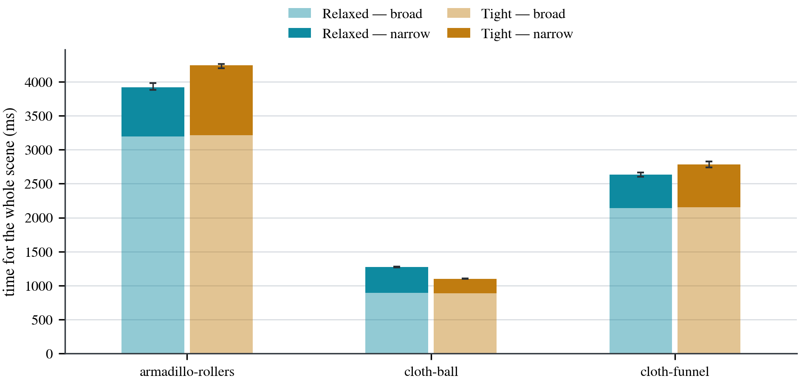
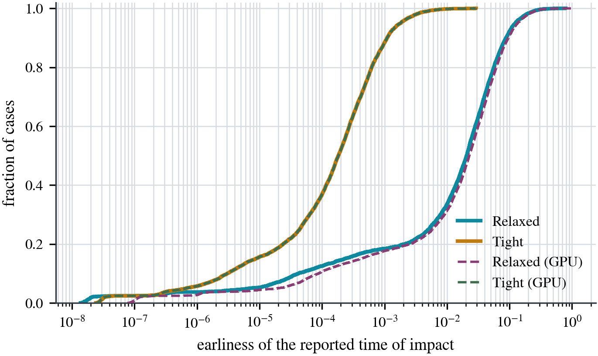

# Benchmarks

Every number in this document is generated from a committed CSV by a committed
script. Nothing here is typed in by hand, and the claim is checkable:

```sh
python3 -m report benchmark/results/<sweep>.csv /tmp/report \
        benchmark/results/<oracle>.csv --embed=docs/BENCHMARKS.md --check
```

returns non-zero if this document is not what the data reproduces. Run it
without `--check` to refresh it.

To measure from scratch:

```sh
benchmark/scripts/prepare_data.sh          # download, convert, verify the oracle
benchmark/scripts/sweep.sh --repeats 5     # resumable; one Slurm job per pack
python3 -m report <sweep>.csv out <oracle>.csv
```

`prepare_data.sh` refuses to finish if the ground truth is incomplete, and the
sweep is resumable at chunk granularity, so an interrupted run is continued by
running it again.

## What is being measured

SCCD is a **conservative** continuous collision detector, and conservativeness is
an invariant rather than a quality:

- A reported time of impact must be **at or before** the true one. Later lets a
  simulation step through the contact, which is the failure the whole search
  exists to prevent.
- A collision that exists must be reported. A missed collision is a correctness
  failure, never a trade for speed.
- Reporting a collision that does not exist, or a time of impact earlier than the
  true one, is **acceptable**: it costs work and step size, not safety.

That asymmetry decides how the results are read. Speed and tightness are
negotiable; the two tables headed *conservativeness* are not. Both are checked
against the dataset's exact symbolic roots, not against another implementation.

**A difference smaller than the run-to-run spread is not a result.** Every
repeated measurement is reported as `median / slowest`, so the spread is visible
and checkable rather than asserted as a percentage; figures draw it, and the
mode comparisons below refuse to state a ratio when the gap is inside it.
Distributions over cases carry their worst case for the same reason — a median
describes the typical case, and the cost of this search is paid in the worst
one.

## Platform

One GH200 node on CSCS Alps: Grace (288 hardware threads, `OMP_NUM_THREADS` set
to the node's core count) and Hopper sm_90 in the same allocation, built with
`prgenv-gnu/24.11:v2`, `-O3`, `CMAKE_CUDA_ARCHITECTURES=90`. Search parameters
are the shipped defaults. Rows marked *(GPU)* ran with
`SCCD_BENCH_EXECUTION_SPACE=device`; the rest ran on Grace.

Mesh geometry is stored and read in **double** — smesh built with
`SMESH_GEOM_TYPE=float64`, frames converted to `x.float64`. That matters for the
mesh path and only there. Two of the scenes ship PLY files declaring
`property double`, so a float32 mesh store discards real data: on
armadillo-rollers it perturbs coordinates by up to 5.95e-8 relative, and near a
grazing contact that moves the root by far more than it moves the coordinate.
Measured over 200 armadillo-rollers cases, float32 mesh geometry makes the
earliest-impact answer land after the exact root in 66 of them and float64 in
none, while the narrow-phase false positives are identical either way — that
path takes its coordinates from the query sets, in double, and never reads the
mesh. The double build is also the faster of the two here, 34 s against 57 s,
because tighter coordinates give tighter swept boxes and fewer candidate pairs.

## Scenes

The dataset is the NYU CCD benchmark (archive 2451/74508), real simulation
frames rather than synthetic motion. Each case is one step, with a curated query
set whose coordinates are exact dyadic rationals and whose roots were computed
symbolically.

All six scenes are swept, every case of every one:


The scenes differ by orders of magnitude in every dimension, which is the point
of using all of them: puffer-ball's surface is 1,064,216 triangles against
armadillo-rollers' 24,242, and rod-twist contributes 4,571 of the 6,394 steps
while cloth-ball contributes 79.

<!-- sccd:begin dataset -->

| scene             | cases | candidate pairs/step |   queries | with a root |
|-------------------|------:|---------------------:|----------:|------------:|
| armadillo-rollers |   781 |              109,214 |   131,441 |     130,859 |
| cloth-ball        |    79 |            2,217,099 |   664,940 |     664,919 |
| cloth-funnel      |   577 |               43,661 |     7,552 |       6,773 |
| n-body            |   146 |           15,436,757 | 2,947,719 |   2,947,611 |
| puffer-ball       |   240 |           30,529,227 | 1,514,172 |   1,486,790 |
| rod-twist         | 4,571 |              847,250 |   549,208 |     285,431 |

Source: `benchmark/results/sweep-gh200-all.csv`

<!-- sccd:end dataset -->

Accuracy is measured on the curated query sets, because the exact roots belong
to those coordinates specifically. The mesh path is a separately stored copy of
the same frames, read from PLY, and is reported beside them rather than checked
against them.

### Ground-truth coverage

The dataset states each query's outcome twice — a boolean in `mma_bool` and a
time of impact in `roots` — and `benchmark/verify_oracle.py` requires them to
agree query for query, `mma_bool[i] == isfinite(toi[i])`. A `true` against a NaN
is a root that never converted, and downstream it is indistinguishable from "no
collision", so an incomplete oracle silently shrinks the evidence instead of
announcing itself. The gate runs as part of `prepare_data.sh` and exits non-zero
on any gap.

Coverage is complete on all six scenes. A query carries a root exactly when
`mma_bool` marks it as colliding, and the counts agree on every one: 130,859 of
armadillo-rollers' 131,441 queries, 664,919 of cloth-ball's 664,940, 6,773 of
cloth-funnel's 7,552, 2,947,611 of n-body-simulation's 2,947,719, 1,486,790 of
puffer-ball's 1,514,172, and 285,431 of rod-twist's 549,208. The proportion
varies by scene because it is the fraction of curated queries that collide, not
a measure of how much of the oracle converted — rod-twist's 52% and cloth-ball's
99.997% are both complete.

## Modes

`Relaxed` (`SCCD_NARROWPHASE_MODE=0`) and `Tight` (`=2`) differ in **how early
they accept a box**, not in how fast they run. `Relaxed` compares codomain widths
against domain tolerances, so it accepts sooner: fewer boxes, and a time of
impact further before the true one. `Tight` compares domain widths against
domain tolerances. Both are conservative by construction; they sit at opposite
ends of the accuracy-for-work trade.

`ToiOutput::Earliest` (`find_earliest_impact_time`) returns one time of impact
for the whole step, so every query prunes against the running minimum.
`ToiOutput::PerPair` (`find_impact_times`) returns one result per candidate with
no shared bound, and does correspondingly more work.

The Earliest answer is **not reproducible run to run**: the parallel search
prunes against a running best, so which box is accepted depends on scheduling,
and the reported time of impact varies between runs of the same binary on the
same input. It varies in tightness only — it is never later than the true root —
but it is a reason to read the spread rather than a single figure.

## Conservativeness

The invariant, checked against the dataset's exact symbolic roots for every mode
on every scene, CPU and GPU. **Zero missed collisions and zero late times of
impact in all forty-eight configurations.**

<!-- sccd:begin gate -->

| scene             | phase | mode          | queries checked | missed | late |
|-------------------|-------|---------------|----------------:|-------:|-----:|
| armadillo-rollers | EE    | Relaxed (GPU) |          98,757 |      0 |    0 |
| armadillo-rollers | EE    | Tight (GPU)   |          98,757 |      0 |    0 |
| armadillo-rollers | EE    | Relaxed       |          98,757 |      0 |    0 |
| armadillo-rollers | EE    | Tight         |          98,757 |      0 |    0 |
| armadillo-rollers | VF    | Relaxed (GPU) |          32,102 |      0 |    0 |
| armadillo-rollers | VF    | Tight (GPU)   |          32,102 |      0 |    0 |
| armadillo-rollers | VF    | Relaxed       |          32,102 |      0 |    0 |
| armadillo-rollers | VF    | Tight         |          32,102 |      0 |    0 |
| cloth-ball        | EE    | Relaxed (GPU) |         557,667 |      0 |    0 |
| cloth-ball        | EE    | Tight (GPU)   |         557,667 |      0 |    0 |
| cloth-ball        | EE    | Relaxed       |         557,667 |      0 |    0 |
| cloth-ball        | EE    | Tight         |         557,667 |      0 |    0 |
| cloth-ball        | VF    | Relaxed (GPU) |         107,252 |      0 |    0 |
| cloth-ball        | VF    | Tight (GPU)   |         107,252 |      0 |    0 |
| cloth-ball        | VF    | Relaxed       |         107,252 |      0 |    0 |
| cloth-ball        | VF    | Tight         |         107,252 |      0 |    0 |
| cloth-funnel      | EE    | Relaxed (GPU) |           6,249 |      0 |    0 |
| cloth-funnel      | EE    | Tight (GPU)   |           6,249 |      0 |    0 |
| cloth-funnel      | EE    | Relaxed       |           6,249 |      0 |    0 |
| cloth-funnel      | EE    | Tight         |           6,249 |      0 |    0 |
| cloth-funnel      | VF    | Relaxed (GPU) |             524 |      0 |    0 |
| cloth-funnel      | VF    | Tight (GPU)   |             524 |      0 |    0 |
| cloth-funnel      | VF    | Relaxed       |             524 |      0 |    0 |
| cloth-funnel      | VF    | Tight         |             524 |      0 |    0 |
| n-body            | EE    | Relaxed (GPU) |       2,399,741 |      0 |    0 |
| n-body            | EE    | Tight (GPU)   |       2,399,741 |      0 |    0 |
| n-body            | EE    | Relaxed       |       2,399,741 |      0 |    0 |
| n-body            | EE    | Tight         |       2,399,741 |      0 |    0 |
| n-body            | VF    | Relaxed (GPU) |         547,870 |      0 |    0 |
| n-body            | VF    | Tight (GPU)   |         547,870 |      0 |    0 |
| n-body            | VF    | Relaxed       |         547,870 |      0 |    0 |
| n-body            | VF    | Tight         |         547,870 |      0 |    0 |
| puffer-ball       | EE    | Relaxed (GPU) |       1,187,257 |      0 |    0 |
| puffer-ball       | EE    | Tight (GPU)   |       1,187,257 |      0 |    0 |
| puffer-ball       | EE    | Relaxed       |       1,187,257 |      0 |    0 |
| puffer-ball       | EE    | Tight         |       1,187,257 |      0 |    0 |
| puffer-ball       | VF    | Relaxed (GPU) |         299,533 |      0 |    0 |
| puffer-ball       | VF    | Tight (GPU)   |         299,533 |      0 |    0 |
| puffer-ball       | VF    | Relaxed       |         299,533 |      0 |    0 |
| puffer-ball       | VF    | Tight         |         299,533 |      0 |    0 |
| rod-twist         | EE    | Relaxed (GPU) |         245,025 |      0 |    0 |
| rod-twist         | EE    | Tight (GPU)   |         245,025 |      0 |    0 |
| rod-twist         | EE    | Relaxed       |         245,025 |      0 |    0 |
| rod-twist         | EE    | Tight         |         245,025 |      0 |    0 |
| rod-twist         | VF    | Relaxed (GPU) |          40,406 |      0 |    0 |
| rod-twist         | VF    | Tight (GPU)   |          40,406 |      0 |    0 |
| rod-twist         | VF    | Relaxed       |          40,406 |      0 |    0 |
| rod-twist         | VF    | Tight         |          40,406 |      0 |    0 |

TightInclusion is excluded from this table: it is the reference the queries were selected against, not a subject of it.

Source: `benchmark/results/oracle-gh200-all.csv`

<!-- sccd:end gate -->

Per-scene, with the false positives that are the price of accepting early, and
one column that is not part of the gate:

<!-- sccd:begin conservativeness -->

| scene             | mode          |   queries | toi compared | late | false pos. | false neg. | mesh-path divergence |
|-------------------|---------------|----------:|-------------:|-----:|-----------:|-----------:|---------------------:|
| armadillo-rollers | Relaxed (GPU) |   131,441 |      130,859 |    0 |        322 |          0 |                    0 |
| armadillo-rollers | Tight (GPU)   |   131,441 |      130,859 |    0 |         24 |          0 |                    0 |
| armadillo-rollers | Relaxed       |   131,441 |      130,859 |    0 |        232 |          0 |                    0 |
| armadillo-rollers | Tight         |   131,441 |      130,859 |    0 |         24 |          0 |                    0 |
| cloth-ball        | Relaxed (GPU) |   664,940 |      664,919 |    0 |          2 |          0 |                    0 |
| cloth-ball        | Tight (GPU)   |   664,940 |      664,919 |    0 |          1 |          0 |                    0 |
| cloth-ball        | Relaxed       |   664,940 |      664,919 |    0 |          2 |          0 |                    0 |
| cloth-ball        | Tight         |   664,940 |      664,919 |    0 |          1 |          0 |                    0 |
| cloth-funnel      | Relaxed (GPU) |     7,552 |        6,773 |    0 |        742 |          0 |                    0 |
| cloth-funnel      | Tight (GPU)   |     7,552 |        6,773 |    0 |         15 |          0 |                    0 |
| cloth-funnel      | Relaxed       |     7,552 |        6,773 |    0 |        687 |          0 |                    0 |
| cloth-funnel      | Tight         |     7,552 |        6,773 |    0 |         15 |          0 |                    0 |
| n-body            | Relaxed (GPU) | 2,947,719 |    2,947,611 |    0 |         28 |          0 |                    0 |
| n-body            | Tight (GPU)   | 2,947,719 |    2,947,611 |    0 |         12 |          0 |                    0 |
| n-body            | Relaxed       | 2,947,719 |    2,947,611 |    0 |          9 |          0 |                    0 |
| n-body            | Tight         | 2,947,719 |    2,947,611 |    0 |         11 |          0 |                    0 |
| puffer-ball       | Relaxed (GPU) | 1,514,172 |    1,486,790 |    0 |     27,380 |          0 |                    0 |
| puffer-ball       | Tight (GPU)   | 1,514,172 |    1,486,790 |    0 |        558 |          0 |                    0 |
| puffer-ball       | Relaxed       | 1,514,172 |    1,486,790 |    0 |     27,380 |          0 |                    0 |
| puffer-ball       | Tight         | 1,514,172 |    1,486,790 |    0 |        536 |          0 |                    0 |
| rod-twist         | Relaxed (GPU) |   549,208 |      285,431 |    0 |    244,973 |          0 |                    0 |
| rod-twist         | Tight (GPU)   |   549,208 |      285,431 |    0 |      1,245 |          0 |                    0 |
| rod-twist         | Relaxed       |   549,208 |      285,431 |    0 |    228,608 |          0 |                    0 |
| rod-twist         | Tight         |   549,208 |      285,431 |    0 |      1,243 |          0 |                    0 |

Measured against the exact roots shipped with the dataset, not against TightInclusion: TightInclusion's own answer is itself a lower bound on the truth, so comparing against it over-reports lateness. The last column is not part of the gate. It counts cases where the earliest-impact answer computed over the *mesh* is later than the earliest exact root of the *curated queries*, which are two separately stored geometries: the mesh is read from PLY, the queries are exact dyadic rationals. It is a measure of the agreement between those two inputs rather than of the kernel, and with the mesh stored in double it is zero everywhere.

Source: `benchmark/results/sweep-gh200-all.csv`

<!-- sccd:end conservativeness -->

The last column deserves its own sentence, because it looks like a violation and
is not. It counts cases where the earliest-impact answer computed over the
**mesh** lands after the earliest exact root of the **curated queries** — two
separately stored copies of the same frames, one read from PLY and one written
as exact dyadic rationals. It measures the agreement between two inputs, not a
kernel reporting late, which is why it is reported and not gated on. With the
mesh stored in double it is **zero on every scene and every mode**; a float32
mesh store puts it in the hundreds on the two scenes whose PLY files declare
`property double`, which is what decided the storage type.

## Timing

Whole-scene wall clock, summed over every case, median of three independent
runs with the full run-to-run range beside it.

<!-- sccd:begin timing -->

| scene             | mode          | cases |         pairs | rep |           prep ms |          broad ms |       earliest ms |       per-pair ms |            total ms |
|-------------------|---------------|------:|--------------:|----:|------------------:|------------------:|------------------:|------------------:|--------------------:|
| armadillo-rollers | Relaxed (GPU) |   781 |    85,296,282 |   3 |   2167.9 / 2205.4 |     978.5 / 985.2 |   1828.5 / 1832.7 |   2842.3 / 2846.6 |     4970.4 / 5019.1 |
| armadillo-rollers | Tight (GPU)   |   781 |    85,296,282 |   3 |   2084.0 / 2102.5 |     974.0 / 982.9 |   2097.9 / 2119.9 |   3235.1 / 3236.8 |     5174.5 / 5186.8 |
| armadillo-rollers | Relaxed       |   781 |    85,296,282 |   3 |   8048.7 / 8056.8 |   3294.5 / 3299.1 |     739.7 / 745.2 |   2925.5 / 2935.8 |   12082.6 / 12091.1 |
| armadillo-rollers | Tight         |   781 |    85,296,282 |   3 |   8089.9 / 8118.1 |   3281.4 / 3281.5 |   1037.7 / 1041.0 |   3535.9 / 3546.2 |   12412.3 / 12423.5 |
| cloth-ball        | Relaxed (GPU) |    79 |   175,150,856 |   3 |     540.0 / 543.5 |     432.3 / 436.3 |     507.2 / 518.2 |   1130.0 / 1131.1 |     1483.1 / 1488.6 |
| cloth-ball        | Tight (GPU)   |    79 |   175,150,856 |   3 |     539.9 / 540.5 |     422.0 / 425.5 |     521.8 / 528.8 |   1076.5 / 1076.9 |     1485.3 / 1488.3 |
| cloth-ball        | Relaxed       |    79 |   175,150,856 |   3 |   1240.5 / 1246.9 |     943.4 / 949.2 |     385.5 / 390.9 |     811.9 / 815.9 |     2573.4 / 2580.5 |
| cloth-ball        | Tight         |    79 |   175,150,856 |   3 |   1255.1 / 1256.7 |     930.1 / 932.8 |     214.3 / 214.7 |   1207.3 / 1213.0 |     2398.0 / 2402.8 |
| cloth-funnel      | Relaxed (GPU) |   577 |    25,192,698 |   3 |   1392.3 / 1395.7 |     588.7 / 643.4 |     876.7 / 937.9 |     779.1 / 796.6 |     2857.7 / 2977.0 |
| cloth-funnel      | Tight (GPU)   |   577 |    25,192,698 |   3 |   1318.7 / 1363.0 |     584.7 / 642.4 |   1008.8 / 1085.2 |   1161.0 / 1213.0 |     2956.4 / 3046.3 |
| cloth-funnel      | Relaxed       |   577 |    25,192,698 |   3 |   5600.3 / 5622.1 |   2141.7 / 2152.0 |     521.6 / 527.2 |    996.2 / 1002.3 |     8273.9 / 8291.0 |
| cloth-funnel      | Tight         |   577 |    25,192,698 |   3 |   5656.6 / 5678.7 |   2156.1 / 2161.2 |     657.3 / 660.2 |   1282.9 / 1288.8 |     8436.1 / 8492.1 |
| n-body            | Relaxed (GPU) |   146 | 2,253,766,609 |   3 |   1568.1 / 1575.0 |   1731.4 / 1731.6 |   5510.6 / 5561.2 |   5131.9 / 5218.4 |     8810.1 / 8867.8 |
| n-body            | Tight (GPU)   |   146 | 2,253,766,609 |   3 |   1590.7 / 1590.7 |   1776.2 / 1784.4 |   5512.7 / 5760.3 |   4689.2 / 4823.7 |     8877.5 / 8983.7 |
| n-body            | Relaxed       |   146 | 2,253,766,609 |   3 |   2529.1 / 2607.4 |   7218.4 / 7250.1 |   3506.9 / 3562.4 | 10143.0 / 10207.3 |   13332.7 / 13341.6 |
| n-body            | Tight         |   146 | 2,253,766,609 |   3 |   2605.5 / 2641.3 |   7167.6 / 7244.2 |   1728.7 / 1734.5 | 19545.5 / 19820.8 |   11537.6 / 11584.2 |
| puffer-ball       | Relaxed (GPU) |   240 | 7,327,014,600 |   3 | 17279.7 / 17383.1 | 34320.7 / 34397.6 | 44845.0 / 45389.0 | 11324.8 / 11859.4 |   96548.8 / 97066.4 |
| puffer-ball       | Tight (GPU)   |   240 | 7,327,014,600 |   3 | 17177.2 / 17225.4 | 34169.6 / 34786.8 | 45823.5 / 46331.1 | 12025.8 / 12053.6 |   97381.8 / 97585.0 |
| puffer-ball       | Relaxed       |   240 | 7,327,014,600 |   3 | 19210.1 / 20116.2 | 28195.8 / 28675.9 | 12216.3 / 12498.6 | 14243.4 / 14443.4 |   59355.3 / 61290.7 |
| puffer-ball       | Tight         |   240 | 7,327,014,600 |   3 | 18903.1 / 19701.0 | 28180.7 / 28348.7 |   6099.9 / 6115.2 | 56649.4 / 56767.5 |   53180.4 / 54164.8 |
| rod-twist         | Relaxed (GPU) |  4571 | 3,872,779,843 |   3 | 26351.6 / 26404.9 |   7270.5 / 7416.1 | 10631.1 / 11069.8 | 22397.6 / 22889.0 |   44306.5 / 44837.6 |
| rod-twist         | Tight (GPU)   |  4571 | 3,872,779,843 |   3 | 25123.6 / 26371.0 |   7072.9 / 7459.7 | 20088.8 / 20585.9 | 31786.9 / 32696.7 |   52285.3 / 54416.6 |
| rod-twist         | Relaxed       |  4571 | 3,872,779,843 |   3 | 67525.1 / 67546.4 | 28924.7 / 28955.8 | 13372.9 / 13380.9 | 40385.1 / 40454.8 | 109852.0 / 109853.7 |
| rod-twist         | Tight         |  4571 | 3,872,779,843 |   3 | 67670.2 / 69161.1 | 28687.3 / 28880.4 | 18538.1 / 18609.7 | 65466.3 / 65512.7 | 114672.1 / 116651.2 |

Each cell is the median over repeats and the slowest of them. A difference smaller than the gap between the two does not separate two modes and is not reported as a ratio anywhere in this document. Which mode is faster depends on the output mode as well as the scene, so the two are given side by side rather than one standing for the other.

Source: `benchmark/results/sweep-gh200-all.csv`

<!-- sccd:end timing -->

Whole-scene milliseconds cannot be compared between a 79-case scene and a
4,571-case one; throughput can:

<!-- sccd:begin throughput -->

| scene             | mode          | broad Mpair/s | narrow Mpair/s |
|-------------------|---------------|--------------:|---------------:|
| armadillo-rollers | Relaxed (GPU) |          87.2 |           46.6 |
| armadillo-rollers | Tight (GPU)   |          87.6 |           40.7 |
| armadillo-rollers | Relaxed       |          25.9 |          115.3 |
| armadillo-rollers | Tight         |          26.0 |           82.2 |
| cloth-ball        | Relaxed (GPU) |         405.2 |          345.3 |
| cloth-ball        | Tight (GPU)   |         415.1 |          335.7 |
| cloth-ball        | Relaxed       |         185.7 |          454.4 |
| cloth-ball        | Tight         |         188.3 |          817.5 |
| cloth-funnel      | Relaxed (GPU) |          42.8 |           28.7 |
| cloth-funnel      | Tight (GPU)   |          43.1 |           25.0 |
| cloth-funnel      | Relaxed       |          11.8 |           48.3 |
| cloth-funnel      | Tight         |          11.7 |           38.3 |
| n-body            | Relaxed (GPU) |        1301.7 |          409.0 |
| n-body            | Tight (GPU)   |        1268.9 |          408.8 |
| n-body            | Relaxed       |         312.2 |          642.7 |
| n-body            | Tight         |         314.4 |         1303.7 |
| puffer-ball       | Relaxed (GPU) |         213.5 |          163.4 |
| puffer-ball       | Tight (GPU)   |         214.4 |          159.9 |
| puffer-ball       | Relaxed       |         259.9 |          599.8 |
| puffer-ball       | Tight         |         260.0 |         1201.2 |
| rod-twist         | Relaxed (GPU) |         532.7 |          364.3 |
| rod-twist         | Tight (GPU)   |         547.5 |          192.8 |
| rod-twist         | Relaxed       |         133.9 |          289.6 |
| rod-twist         | Tight         |         135.0 |          208.9 |

Source: `benchmark/results/sweep-gh200-all.csv`

<!-- sccd:end throughput -->

**Neither mode is uniformly faster**, which is the substantive result here and
the reason the trade is worth stating as a trade:

<!-- sccd:begin comparison -->

- **armadillo-rollers (CPU, earliest)**: Relaxed is 1.40× faster than Tight in the narrow phase (740 ms against 1038 ms; run-to-run spread 1.6%).
- **armadillo-rollers (CPU, per-pair)**: Relaxed is 1.21× faster than Tight in the narrow phase (2925 ms against 3536 ms; run-to-run spread 0.6%).
- **armadillo-rollers (GPU, earliest)**: Relaxed (GPU) is 1.15× faster than Tight (GPU) in the narrow phase (1828 ms against 2098 ms; run-to-run spread 1.2%).
- **armadillo-rollers (GPU, per-pair)**: Relaxed (GPU) is 1.14× faster than Tight (GPU) in the narrow phase (2842 ms against 3235 ms; run-to-run spread 0.9%).
- **cloth-ball (CPU, earliest)**: Tight is 1.80× faster than Relaxed in the narrow phase (214 ms against 385 ms; run-to-run spread 2.0%).
- **cloth-ball (CPU, per-pair)**: Relaxed is 1.49× faster than Tight in the narrow phase (812 ms against 1207 ms; run-to-run spread 1.7%).
- **cloth-ball (GPU, earliest)**: Relaxed (GPU) and Tight (GPU) are inside noise (507 ms against 522 ms, spread 2.8%); this does not separate them.
- **cloth-ball (GPU, per-pair)**: Tight (GPU) is 1.05× faster than Relaxed (GPU) in the narrow phase (1077 ms against 1130 ms; run-to-run spread 0.8%).
- **cloth-funnel (CPU, earliest)**: Relaxed is 1.26× faster than Tight in the narrow phase (522 ms against 657 ms; run-to-run spread 6.4%).
- **cloth-funnel (CPU, per-pair)**: Relaxed is 1.29× faster than Tight in the narrow phase (996 ms against 1283 ms; run-to-run spread 0.9%).
- **cloth-funnel (GPU, earliest)**: Relaxed (GPU) and Tight (GPU) are inside noise (877 ms against 1009 ms, spread 13.9%); this does not separate them.
- **cloth-funnel (GPU, per-pair)**: Relaxed (GPU) is 1.49× faster than Tight (GPU) in the narrow phase (779 ms against 1161 ms; run-to-run spread 13.7%).
- **n-body (CPU, earliest)**: Tight is 2.03× faster than Relaxed in the narrow phase (1729 ms against 3507 ms; run-to-run spread 1.7%).
- **n-body (CPU, per-pair)**: Relaxed is 1.93× faster than Tight in the narrow phase (10143 ms against 19546 ms; run-to-run spread 1.8%).
- **n-body (GPU, earliest)**: Relaxed (GPU) and Tight (GPU) are inside noise (5511 ms against 5513 ms, spread 5.0%); this does not separate them.
- **n-body (GPU, per-pair)**: Tight (GPU) is 1.09× faster than Relaxed (GPU) in the narrow phase (4689 ms against 5132 ms; run-to-run spread 3.9%).
- **puffer-ball (CPU, earliest)**: Tight is 2.00× faster than Relaxed in the narrow phase (6100 ms against 12216 ms; run-to-run spread 4.5%).
- **puffer-ball (CPU, per-pair)**: Relaxed is 3.98× faster than Tight in the narrow phase (14243 ms against 56649 ms; run-to-run spread 3.9%).
- **puffer-ball (GPU, earliest)**: Relaxed (GPU) and Tight (GPU) are inside noise (44845 ms against 45823 ms, spread 2.3%); this does not separate them.
- **puffer-ball (GPU, per-pair)**: Relaxed (GPU) and Tight (GPU) are inside noise (11325 ms against 12026 ms, spread 6.0%); this does not separate them.
- **rod-twist (CPU, earliest)**: Relaxed is 1.39× faster than Tight in the narrow phase (13373 ms against 18538 ms; run-to-run spread 1.0%).
- **rod-twist (CPU, per-pair)**: Relaxed is 1.62× faster than Tight in the narrow phase (40385 ms against 65466 ms; run-to-run spread 1.3%).
- **rod-twist (GPU, earliest)**: Relaxed (GPU) is 1.89× faster than Tight (GPU) in the narrow phase (10631 ms against 20089 ms; run-to-run spread 11.9%).
- **rod-twist (GPU, per-pair)**: Relaxed (GPU) is 1.42× faster than Tight (GPU) in the narrow phase (22398 ms against 31787 ms; run-to-run spread 13.2%).

<!-- sccd:end comparison -->

The split between the two output modes is the mechanism, not a detail.
`Relaxed` accepts a box sooner, so it does less work per query — but a looser
acceptance also means a looser bound to hand the next query, so it prunes less.
`ToiOutput::PerPair` has no shared bound to lose, and there `Relaxed` is faster
on **every** scene. `ToiOutput::Earliest` reintroduces it, and on the three
scenes with the most candidate pairs per step the pruning `Tight` buys back is
worth more than the per-query work it costs, so the ranking inverts. Which
effect wins is a property of the scene and of what is being asked, not of the
mode alone.

**The two processors divide the work differently, and not in the same direction
on every scene.** The usual pattern is that Hopper wins the broad phase and
loses the narrow one: on five of the six scenes its broad phase runs 2.2× to
4.2× faster than Grace's while its narrow phase runs 0.27× to 0.76× as fast, and
the broad phase is large enough that the GPU still wins end to end by 1.5× to
2.9×.

Two scenes break it, in opposite directions. On **rod-twist** the GPU wins every
phase, narrow phase included (1.26×), for 2.50× overall. On **puffer-ball** it
loses outright, 0.62× end to end — the only scene where the GPU is the wrong
processor. Its narrow phase there takes 44.9 s against the host's 12.2 s, and
unusually its broad phase does not compensate, running slightly slower as well
(34.2 s against 28.3 s). puffer-ball is the largest scene in the set by candidate
pairs, 30.5 million per step, so this is the GPU losing where the problem is
biggest rather than where it is smallest.

Comparisons above are made within a processor for that reason: ranking every mode
of a scene together would compare host `Relaxed` against GPU `Tight` and report
the sum of two unrelated effects as if it were the mode trade.

## Against TightInclusion

TightInclusion is the reference implementation of a certified conservative
narrow phase. Matching its hit count is the strongest agreement available;
reporting more hits is a false positive, which costs work and is never unsafe.
Its own answer is a lower bound on the truth rather than the truth, which is why
the conservativeness table above is measured against the exact roots instead.

**How the reference is configured.** A ratio against a baseline is only worth
reading if the baseline was allowed to do what the measured code does, so both
sides here are given the same task and the same machine:

- **The same question.** Both compute a time of impact for *every* query — SCCD
  at `ToiOutput::PerPair`, TightInclusion unbounded over the whole step. Neither
  prunes against a shared running minimum, so neither is answering the cheaper
  "earliest over the set" question the other is not.
- **The same scheduler.** Both loops run through
  `sccd::parallel_for_br_dynamic`, the skew-aware helper the narrow phase uses
  for its own root finding. Timing a parallel narrow phase against a serial
  reference would report the thread count as though it were an algorithmic
  result.
- **Unmodified.** TightInclusion is used exactly as released; everything above
  is arranged on SCCD's side of the interface.

The hit counts are unchanged by the threading — verified identical at 1, 8 and
64 threads — so only the times move.

<!-- sccd:begin reference -->

| scene             | phase | mode           |   queries |      hits |        time ms |     vs. TI |
|-------------------|-------|----------------|----------:|----------:|---------------:|-----------:|
| armadillo-rollers | EE    | Relaxed (GPU)  |    99,104 |    98,933 |    2335 / 2349 |       4.5× |
| armadillo-rollers | EE    | Tight (GPU)    |    99,104 |    98,761 |    2908 / 2910 |       3.6× |
| armadillo-rollers | EE    | Relaxed        |    99,104 |    98,895 |    3377 / 3384 |       3.1× |
| armadillo-rollers | EE    | Tight          |    99,104 |    98,761 |    6474 / 6502 |       1.6× |
| armadillo-rollers | EE    | TightInclusion |    99,104 |    98,761 |  10499 / 10604 | 1.0× (ref) |
| armadillo-rollers | VF    | Relaxed (GPU)  |    32,337 |    32,248 |    3469 / 3476 |       2.2× |
| armadillo-rollers | VF    | Tight (GPU)    |    32,337 |    32,122 |    1987 / 2011 |       3.8× |
| armadillo-rollers | VF    | Relaxed        |    32,337 |    32,196 |    2219 / 2242 |       3.4× |
| armadillo-rollers | VF    | Tight          |    32,337 |    32,122 |    2717 / 2743 |       2.8× |
| armadillo-rollers | VF    | TightInclusion |    32,337 |    32,122 |    7609 / 7686 | 1.0× (ref) |
| cloth-ball        | EE    | Relaxed (GPU)  |   557,683 |   557,669 |      645 / 647 |       2.4× |
| cloth-ball        | EE    | Tight (GPU)    |   557,683 |   557,668 |      609 / 612 |       2.5× |
| cloth-ball        | EE    | Relaxed        |   557,683 |   557,669 |      402 / 404 |       3.8× |
| cloth-ball        | EE    | Tight          |   557,683 |   557,668 |      955 / 961 |       1.6× |
| cloth-ball        | EE    | TightInclusion |   557,683 |   557,668 |    1523 / 1529 | 1.0× (ref) |
| cloth-ball        | VF    | Relaxed (GPU)  |   107,257 |   107,252 |    2212 / 2367 |       0.6× |
| cloth-ball        | VF    | Tight (GPU)    |   107,257 |   107,252 |      428 / 429 |       2.9× |
| cloth-ball        | VF    | Relaxed        |   107,257 |   107,252 |      302 / 307 |       4.2× |
| cloth-ball        | VF    | Tight          |   107,257 |   107,252 |      408 / 414 |       3.1× |
| cloth-ball        | VF    | TightInclusion |   107,257 |   107,252 |    1255 / 1267 | 1.0× (ref) |
| cloth-funnel      | EE    | Relaxed (GPU)  |     6,751 |     6,734 |      768 / 793 |       4.1× |
| cloth-funnel      | EE    | Tight (GPU)    |     6,751 |     6,259 |    1358 / 1370 |       2.3× |
| cloth-funnel      | EE    | Relaxed        |     6,751 |     6,700 |    1111 / 1149 |       2.8× |
| cloth-funnel      | EE    | Tight          |     6,751 |     6,259 |    1743 / 1746 |       1.8× |
| cloth-funnel      | EE    | TightInclusion |     6,751 |     6,259 |    3130 / 3137 | 1.0× (ref) |
| cloth-funnel      | VF    | Relaxed (GPU)  |       801 |       781 |    2124 / 2599 |       0.6× |
| cloth-funnel      | VF    | Tight (GPU)    |       801 |       529 |      451 / 456 |       2.9× |
| cloth-funnel      | VF    | Relaxed        |       801 |       760 |      402 / 410 |       3.3× |
| cloth-funnel      | VF    | Tight          |       801 |       529 |      394 / 395 |       3.4× |
| cloth-funnel      | VF    | TightInclusion |       801 |       529 |    1321 / 1321 | 1.0× (ref) |
| n-body            | EE    | Relaxed (GPU)  | 2,399,812 | 2,399,762 |    1106 / 1351 |       2.4× |
| n-body            | EE    | Tight (GPU)    | 2,399,812 | 2,399,746 |     890 / 1077 |       3.0× |
| n-body            | EE    | Relaxed        | 2,399,812 | 2,399,747 |    6576 / 6626 |       0.4× |
| n-body            | EE    | Tight          | 2,399,812 | 2,399,746 |    1176 / 1184 |       2.2× |
| n-body            | EE    | TightInclusion | 2,399,812 | 2,399,746 |    2633 / 2657 | 1.0× (ref) |
| n-body            | VF    | Relaxed (GPU)  |   547,907 |   547,877 |    2883 / 2900 |       0.5× |
| n-body            | VF    | Tight (GPU)    |   547,907 |   547,874 |      628 / 790 |       2.5× |
| n-body            | VF    | Relaxed        |   547,907 |   547,873 |      423 / 424 |       3.7× |
| n-body            | VF    | Tight          |   547,907 |   547,873 |      507 / 511 |       3.1× |
| n-body            | VF    | TightInclusion |   547,907 |   547,873 |    1577 / 1587 | 1.0× (ref) |
| puffer-ball       | EE    | Relaxed (GPU)  | 1,206,952 | 1,206,951 |      346 / 346 |       7.6× |
| puffer-ball       | EE    | Tight (GPU)    | 1,206,952 | 1,187,650 |      941 / 943 |       2.8× |
| puffer-ball       | EE    | Relaxed        | 1,206,952 | 1,206,951 |      252 / 254 |      10.5× |
| puffer-ball       | EE    | Tight          | 1,206,952 | 1,187,650 |    1614 / 1629 |       1.6× |
| puffer-ball       | EE    | TightInclusion | 1,206,952 | 1,187,650 |    2642 / 2662 | 1.0× (ref) |
| puffer-ball       | VF    | Relaxed (GPU)  |   307,220 |   307,219 |    2518 / 2549 |       0.6× |
| puffer-ball       | VF    | Tight (GPU)    |   307,220 |   299,698 |      634 / 636 |       2.4× |
| puffer-ball       | VF    | Relaxed        |   307,220 |   307,219 |      209 / 209 |       7.4× |
| puffer-ball       | VF    | Tight          |   307,220 |   299,676 |      586 / 595 |       2.6× |
| puffer-ball       | VF    | TightInclusion |   307,220 |   299,676 |    1544 / 1556 | 1.0× (ref) |
| rod-twist         | EE    | Relaxed (GPU)  |   492,120 |   474,114 |    2898 / 4493 |      28.6× |
| rod-twist         | EE    | Tight (GPU)    |   492,120 |   246,132 |    4913 / 8176 |      16.9× |
| rod-twist         | EE    | Relaxed        |   492,120 |   458,641 |   8100 / 22112 |      10.2× |
| rod-twist         | EE    | Tight          |   492,120 |   246,132 | 37118 / 121624 |       2.2× |
| rod-twist         | EE    | TightInclusion |   492,120 |   246,132 | 82987 / 249504 | 1.0× (ref) |
| rod-twist         | VF    | Relaxed (GPU)  |    57,088 |    56,290 |    3618 / 4208 |       6.5× |
| rod-twist         | VF    | Tight (GPU)    |    57,088 |    40,544 |    3014 / 3236 |       7.8× |
| rod-twist         | VF    | Relaxed        |    57,088 |    55,398 |    2648 / 2974 |       8.9× |
| rod-twist         | VF    | Tight          |    57,088 |    40,542 |   6382 / 10301 |       3.7× |
| rod-twist         | VF    | TightInclusion |    57,088 |    40,542 |  23528 / 43830 | 1.0× (ref) |

Source: `benchmark/results/oracle-gh200-all.csv`

<!-- sccd:end reference -->

## Accuracy

How far before the true time of impact each mode reports. This is the axis the
two modes trade against speed, and early is the safe direction.

The median and the worst case answer different questions, and only the second
one is about step size. A solver does not take the median step: it takes the
step it is given, so the largest earliness anywhere in a scene is the largest
step that mode can cost. The two differ by four to five orders of magnitude
here, and on cloth-funnel and rod-twist the worst case approaches 1.0 — a step
reported at its very beginning when the true contact is at its end. That is
conservative, and it is never a missed collision, but it is a step the solver
does not get to take. Nothing in the conservativeness gate catches it, because
by construction there is nothing there to catch.

It is not a property of these kernels, though: on those scenes TightInclusion's
worst case is the same, to the digit. Grazing and already-touching
configurations leave a conservative search no tighter answer, so the worst case
measures the problem rather than the implementation. The median is where the
implementations actually differ.

<!-- sccd:begin earliness -->

| scene             | mode          | median earliness | worst case |
|-------------------|---------------|-----------------:|-----------:|
| armadillo-rollers | Relaxed (GPU) |         9.18e-05 |   9.42e-01 |
| armadillo-rollers | Tight (GPU)   |         3.41e-06 |   1.60e-02 |
| armadillo-rollers | Relaxed       |         4.66e-05 |   9.41e-01 |
| armadillo-rollers | Tight         |         3.39e-06 |   1.60e-02 |
| cloth-ball        | Relaxed (GPU) |         1.10e-06 |   8.38e-04 |
| cloth-ball        | Tight (GPU)   |         2.70e-07 |   1.77e-04 |
| cloth-ball        | Relaxed       |         3.06e-07 |   5.40e-04 |
| cloth-ball        | Tight         |         2.72e-07 |   1.93e-04 |
| cloth-funnel      | Relaxed (GPU) |         2.65e-02 |   1.00e+00 |
| cloth-funnel      | Tight (GPU)   |         3.22e-04 |   1.00e+00 |
| cloth-funnel      | Relaxed       |         1.40e-02 |   1.00e+00 |
| cloth-funnel      | Tight         |         3.22e-04 |   1.00e+00 |
| n-body            | Relaxed (GPU) |         1.04e-07 |   2.51e-03 |
| n-body            | Tight (GPU)   |         3.02e-08 |   2.17e-04 |
| n-body            | Relaxed       |         1.82e-08 |   1.27e-03 |
| n-body            | Tight         |         3.02e-08 |   2.40e-04 |
| puffer-ball       | Relaxed (GPU) |         4.13e-02 |   9.75e-01 |
| puffer-ball       | Tight (GPU)   |         4.00e-05 |   2.61e-01 |
| puffer-ball       | Relaxed       |         3.98e-02 |   9.75e-01 |
| puffer-ball       | Tight         |         4.00e-05 |   2.61e-01 |
| rod-twist         | Relaxed (GPU) |         2.94e-02 |   9.96e-01 |
| rod-twist         | Tight (GPU)   |         2.75e-04 |   9.93e-01 |
| rod-twist         | Relaxed       |         2.68e-02 |   9.96e-01 |
| rod-twist         | Tight         |         2.75e-04 |   9.93e-01 |

Source: `benchmark/results/sweep-gh200-all.csv`

<!-- sccd:end earliness -->

### Against TightInclusion, on accuracy

The tables above use TightInclusion as the reference for hit versus miss, which
is what it is good for. It is **not** the reference for accuracy: its answer is a
conservative lower bound on the true root, exactly as SCCD's is. So the question
is not how close each mode gets to TightInclusion but how close all three get to
the truth, and the dataset's exact symbolic roots are the only thing in the
comparison that is actually the truth.

**`Tight` does not approximate the reference, it reproduces it.** On all twelve
scene-phases its median earliness and its worst case are identical to
TightInclusion's, to every digit — the same answer, reached faster. `Tight (GPU)`
matches the worst case exactly and the median to within a part in a thousand.
That is the strongest form agreement can take, and it is what makes the speed
comparison meaningful: nothing is being traded for it.

`Relaxed` is the mode that trades, and the table prices the trade: three to ten
times looser at the median, and on the scenes with grazing contact up to two
orders of magnitude looser at the worst case.

**The worst cases belong to the problem, not to SCCD.** On cloth-funnel and
rod-twist the largest earliness approaches 1.0 for *every* implementation
including TightInclusion — on cloth-funnel edge-edge it is exactly 1.0 for all
five. A conservative search on a grazing or already-touching configuration has
no tighter answer available to it, so this is the cost of the guarantee rather
than a defect in any one kernel. The same scenes are where the median earliness
is 0: half those queries are already in contact at the start of the step, and
every implementation returns the true root exactly.

Both are conservative throughout, and so is the reference: over 16,567,149
checked queries each, none of the five reported a time of impact after the true
one and none missed a collision.

<!-- sccd:begin earliness-ref -->

| scene             | phase | mode           | median earliness | worst case |
|-------------------|-------|----------------|-----------------:|-----------:|
| armadillo-rollers | EE    | Relaxed        |         3.47e-05 |   7.37e-01 |
| armadillo-rollers | EE    | Tight          |         3.11e-06 |   1.60e-02 |
| armadillo-rollers | EE    | Relaxed (GPU)  |         7.47e-05 |   7.37e-01 |
| armadillo-rollers | EE    | Tight (GPU)    |         3.08e-06 |   1.60e-02 |
| armadillo-rollers | EE    | TightInclusion |         3.11e-06 |   1.60e-02 |
| armadillo-rollers | VF    | Relaxed        |         6.44e-05 |   9.41e-01 |
| armadillo-rollers | VF    | Tight          |         3.74e-06 |   9.39e-03 |
| armadillo-rollers | VF    | Relaxed (GPU)  |         1.06e-04 |   9.42e-01 |
| armadillo-rollers | VF    | Tight (GPU)    |         3.73e-06 |   9.39e-03 |
| armadillo-rollers | VF    | TightInclusion |         3.74e-06 |   9.39e-03 |
| cloth-ball        | EE    | Relaxed        |         3.13e-07 |   5.40e-04 |
| cloth-ball        | EE    | Tight          |         1.05e-07 |   1.04e-04 |
| cloth-ball        | EE    | Relaxed (GPU)  |         1.13e-06 |   9.22e-04 |
| cloth-ball        | EE    | Tight (GPU)    |         1.05e-07 |   1.04e-04 |
| cloth-ball        | EE    | TightInclusion |         1.05e-07 |   1.04e-04 |
| cloth-ball        | VF    | Relaxed        |         2.96e-07 |   7.86e-05 |
| cloth-ball        | VF    | Tight          |         9.76e-08 |   2.88e-05 |
| cloth-ball        | VF    | Relaxed (GPU)  |         1.09e-06 |   2.15e-04 |
| cloth-ball        | VF    | Tight (GPU)    |         9.75e-08 |   2.88e-05 |
| cloth-ball        | VF    | TightInclusion |         9.76e-08 |   2.88e-05 |
| cloth-funnel      | EE    | Relaxed        |                0 |   1.00e+00 |
| cloth-funnel      | EE    | Tight          |                0 |   1.00e+00 |
| cloth-funnel      | EE    | Relaxed (GPU)  |                0 |   1.00e+00 |
| cloth-funnel      | EE    | Tight (GPU)    |                0 |   1.00e+00 |
| cloth-funnel      | EE    | TightInclusion |                0 |   1.00e+00 |
| cloth-funnel      | VF    | Relaxed        |         1.56e-02 |   9.97e-01 |
| cloth-funnel      | VF    | Tight          |         3.33e-04 |   2.67e-02 |
| cloth-funnel      | VF    | Relaxed (GPU)  |         2.82e-02 |   9.97e-01 |
| cloth-funnel      | VF    | Tight (GPU)    |         3.33e-04 |   2.67e-02 |
| cloth-funnel      | VF    | TightInclusion |         3.33e-04 |   2.67e-02 |
| n-body            | EE    | Relaxed        |         1.79e-08 |   1.27e-03 |
| n-body            | EE    | Tight          |         1.14e-08 |   1.89e-04 |
| n-body            | EE    | Relaxed (GPU)  |         1.10e-07 |   2.51e-03 |
| n-body            | EE    | Tight (GPU)    |         1.14e-08 |   1.89e-04 |
| n-body            | EE    | TightInclusion |         1.14e-08 |   1.89e-04 |
| n-body            | VF    | Relaxed        |         1.84e-08 |   1.53e-04 |
| n-body            | VF    | Tight          |         1.17e-08 |   1.87e-05 |
| n-body            | VF    | Relaxed (GPU)  |         1.03e-07 |   2.64e-04 |
| n-body            | VF    | Tight (GPU)    |         1.17e-08 |   1.87e-05 |
| n-body            | VF    | TightInclusion |         1.17e-08 |   1.87e-05 |
| puffer-ball       | EE    | Relaxed        |         3.57e-02 |   9.61e-01 |
| puffer-ball       | EE    | Tight          |         3.54e-05 |   2.61e-01 |
| puffer-ball       | EE    | Relaxed (GPU)  |         3.64e-02 |   9.62e-01 |
| puffer-ball       | EE    | Tight (GPU)    |         3.54e-05 |   2.61e-01 |
| puffer-ball       | EE    | TightInclusion |         3.54e-05 |   2.61e-01 |
| puffer-ball       | VF    | Relaxed        |         4.68e-02 |   9.75e-01 |
| puffer-ball       | VF    | Tight          |         4.58e-05 |   5.04e-02 |
| puffer-ball       | VF    | Relaxed (GPU)  |         4.60e-02 |   9.75e-01 |
| puffer-ball       | VF    | Tight (GPU)    |         4.56e-05 |   5.04e-02 |
| puffer-ball       | VF    | TightInclusion |         4.58e-05 |   5.04e-02 |
| rod-twist         | EE    | Relaxed        |         2.75e-02 |   9.93e-01 |
| rod-twist         | EE    | Tight          |         2.47e-04 |   9.85e-01 |
| rod-twist         | EE    | Relaxed (GPU)  |         2.94e-02 |   9.93e-01 |
| rod-twist         | EE    | Tight (GPU)    |         2.47e-04 |   9.85e-01 |
| rod-twist         | EE    | TightInclusion |         2.47e-04 |   9.85e-01 |
| rod-twist         | VF    | Relaxed        |         1.41e-02 |   9.96e-01 |
| rod-twist         | VF    | Tight          |         1.28e-04 |   9.93e-01 |
| rod-twist         | VF    | Relaxed (GPU)  |         1.64e-02 |   9.96e-01 |
| rod-twist         | VF    | Tight (GPU)    |         1.28e-04 |   9.93e-01 |
| rod-twist         | VF    | TightInclusion |         1.28e-04 |   9.93e-01 |

Source: `benchmark/results/oracle-gh200-all.csv`

<!-- sccd:end earliness-ref -->


## Scaling with element count

`sccd_refine_scaling` refines one surface repeatedly, quadrupling the element
count at each level, and runs a collision step on each — the one question
neither other driver can answer. Two consecutive cloth-ball frames, 92,230
elements up to 23.6 million.

<!-- sccd:begin scaling -->

| mode                 | level |   elements | candidate pairs | broad ms | narrow ms |    p |
|----------------------|------:|-----------:|----------------:|---------:|----------:|-----:|
| relaxed / host / tri |     0 |     92,230 |          17,982 |     35.3 |       8.6 | 0.86 |
|                      |     1 |    368,920 |          87,848 |     65.3 |       5.2 |      |
|                      |     2 |  1,475,680 |         380,924 |    241.8 |       1.9 |      |
|                      |     3 |  5,902,720 |       1,581,142 |   1008.1 |       6.2 |      |
|                      |     4 | 23,610,880 |       6,440,923 |   4424.2 |      19.9 |      |
| tight / host / tri   |     0 |     92,230 |          17,982 |     35.2 |       4.8 | 0.87 |
|                      |     1 |    368,920 |          87,848 |     62.2 |      10.6 |      |
|                      |     2 |  1,475,680 |         380,924 |    202.0 |       4.2 |      |
|                      |     3 |  5,902,720 |       1,581,142 |    964.3 |       4.5 |      |
|                      |     4 | 23,610,880 |       6,440,923 |   4433.4 |      16.2 |      |

The two frames used here do not come into contact, so the narrow phase has almost no work to do and its column is dominated by noise rather than by element count; what this measures is the broad phase and the preparation that feeds it. Narrow-phase cost against problem size is in the per-case figure, over cases that do collide. The exponent is below 1 because the fixed cost visible at the smallest size is amortised as the mesh grows.

Source: `benchmark/results/scaling/host-mode0.txt, benchmark/results/scaling/host-mode2.txt`

<!-- sccd:end scaling -->


Broad-phase and narrow-phase cost against element count, log-log, over five
refinement levels of the same surface. The fitted exponent is on the broad
phase; the narrow-phase series is flat and noisy because these two frames do not
come into contact.

## Figures



Broad phase (pale) and narrow phase (solid) summed over every case, per mode.
Bars are the median over three repeats; whiskers span the full run-to-run range
of the total, so a difference smaller than a whisker is not a result.


Narrow-phase time for each individual case against the number of candidate pairs
the broad phase handed it, log-log, median over repeats.



Empirical distribution, over cases, of how far before the true time of impact
each mode reports. Earliness is on a log axis, so a curve further left reports
closer to the true root; a curve further right reports earlier, which is always
the safe direction and always costs a solver step size.

## Provenance

<!-- sccd:begin provenance -->

- Timings: `benchmark/results/sweep-gh200-all.csv`, 6394 cases over 6 scenes, 3 independent repeats.
- Accuracy: `benchmark/results/oracle-gh200-all.csv`, every query of every scene checked against the dataset's exact roots.
- Regenerate with `python3 -m report <bench.csv> <out> <oracle.csv> --embed=docs/BENCHMARKS.md`; add `--check` to assert the document still matches the data.

<!-- sccd:end provenance -->
