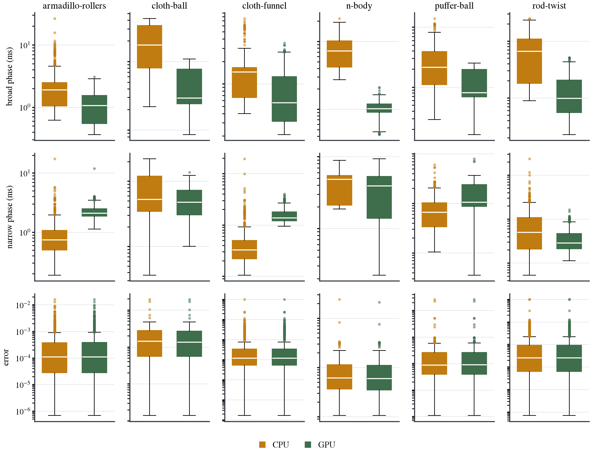
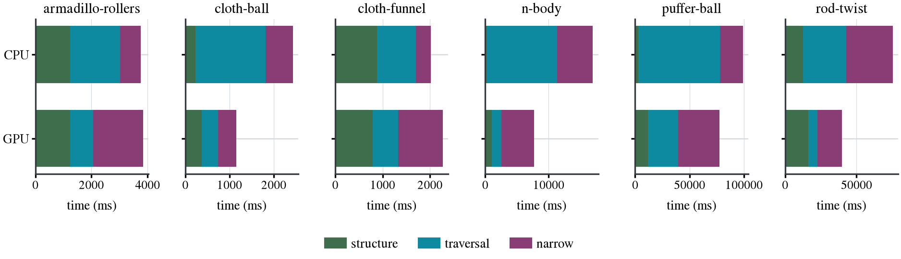
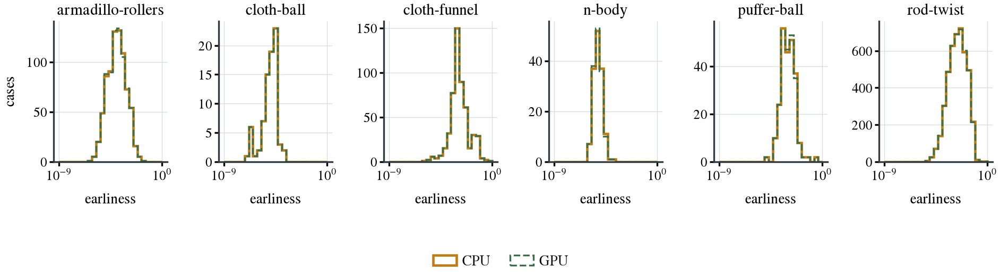
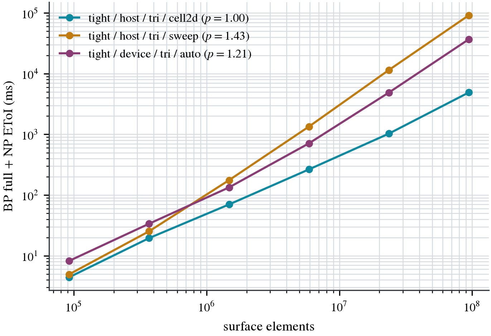

# Benchmarks

SCCD against TightInclusion on the NYU CCD dataset: six scenes, 6,394 cases over
3,561 simulation frames, on one GH200 node — a single Grace at 72 threads and Hopper sm_90 in the
same allocation, `prgenv-gnu/24.11:v2`, `-O3`, `CMAKE_CUDA_ARCHITECTURES=90`,
shipped default search parameters. A GH200 node carries four Grace modules, so
`nproc` there reports 288; host figures are one Grace.

Timings are reported as two phases. **Broad** is the whole broad phase: building
the swept boxes and the acceleration structure, then querying it for overlaps.
**Narrow** is the branch and bound over the candidates it returns. Where the text
explains the broad phase it is decomposed into the *structure* and the
*traversal* over it.

Three results:

- **Conservative on every query.** Zero missed collisions and zero late times of
  impact over 66,268,596 comparisons against exact symbolic roots.
- **Identical accuracy to the reference.** Median and worst-case error match
  TightInclusion's on all twelve scene-phases, to every digit.
- **1.6× to 3.7× faster on CPU** and 2.5× to 18.2× on GPU, at that accuracy.

Every number is generated from a committed CSV by a committed script:

```sh
python3 -m report benchmark/results/sweep-gh200-bp.csv /tmp/report \
        benchmark/results/oracle-gh200-all.csv \
        --modes=tight,device-tight --label="tight:CPU,device-tight:GPU" \
        --embed=docs/BENCHMARKS.md --check
```

`--check` returns non-zero if this document is not what the data reproduces.

## 1. Dataset

The NYU CCD benchmark (archive 2451/74508): real simulation frames, each case a
step with a curated query set whose coordinates are exact dyadic rationals and
whose roots were computed symbolically.

<!-- sccd:begin dataset -->

| scene             | cases | candidate pairs/step |   queries | with a root |
|-------------------|------:|---------------------:|----------:|------------:|
| armadillo-rollers |   781 |              109,214 |   131,441 |     130,859 |
| cloth-ball        |    79 |            2,217,099 |   664,940 |     664,919 |
| cloth-funnel      |   577 |               43,661 |     7,552 |       6,773 |
| n-body            |   146 |           15,436,757 | 2,947,719 |   2,947,611 |
| puffer-ball       |   240 |           30,529,227 | 1,514,172 |   1,486,790 |
| rod-twist         | 4,571 |              847,250 |   549,208 |     285,431 |

Source: `benchmark/results/sweep-gh200-bp.csv`

<!-- sccd:end dataset -->

A query carries a root exactly when the dataset marks it as colliding, and
`benchmark/verify_oracle.py` gates on that agreement query for query. The
proportion differs by scene because it is the fraction of curated queries that
collide, not a measure of coverage.

## 2. What each phase measures

A **case** is one query type on one frame: the dataset ships `100ee` and `100vf`
separately. A simulation step runs both, so a per-frame figure is the two
together.

Each case is timed as three consecutive calls, each with its own clock. The
first case of a scene is run once untimed to pay for allocation and first touch.

**prep** — `broad_phase_prep`. Builds the swept axis-aligned boxes, one per
vertex, face and edge, each enclosing that primitive's whole trajectory over the
step; picks the sort axis from the spread of box centres; and builds the
acceleration structure the traversal needs — the sorted intervals for the sweep,
or the uniform grid for the cell list. It does not look for overlaps.

**broad** — `broad_phase_fv_step` or `broad_phase_ee_step`. The overlap query
itself, over the structure `prep` built: count the candidate pairs, prefix-sum
the counts, then fill the output. A candidate is a pair whose swept boxes
overlap, which is not yet a contact.

**narrow** — `narrow_phase_vf` or `narrow_phase_ee` at `ToiOutput::Earliest`.
Branch and bound over each candidate pair's `(t, u, v)` box, returning one
earliest time of impact for the step, so every query prunes against the running
minimum. This is where the conservativeness guarantee is produced.

`total` is the three added. Nothing else is inside the timers: mesh loading, PLY
conversion and result checking are outside them.

## 3. Conservativeness

The invariant: a reported time of impact must be at or before the true one, and
a collision that exists must be reported. Checked against the exact symbolic
roots, on both processors, for every scene.

<!-- sccd:begin conservativeness -->

| scene             | mode |   queries | toi compared | late | false pos. | false neg. |
|-------------------|------|----------:|-------------:|-----:|-----------:|-----------:|
| armadillo-rollers | GPU  |   131,441 |      130,859 |    0 |         24 |          0 |
| armadillo-rollers | CPU  |   131,441 |      130,859 |    0 |         24 |          0 |
| cloth-ball        | GPU  |   664,940 |      664,919 |    0 |          1 |          0 |
| cloth-ball        | CPU  |   664,940 |      664,919 |    0 |          1 |          0 |
| cloth-funnel      | GPU  |     7,552 |        6,773 |    0 |         15 |          0 |
| cloth-funnel      | CPU  |     7,552 |        6,773 |    0 |         15 |          0 |
| n-body            | GPU  | 2,947,719 |    2,947,611 |    0 |         12 |          0 |
| n-body            | CPU  | 2,947,719 |    2,947,611 |    0 |         11 |          0 |
| puffer-ball       | GPU  | 1,514,172 |    1,486,790 |    0 |        558 |          0 |
| puffer-ball       | CPU  | 1,514,172 |    1,486,790 |    0 |        536 |          0 |
| rod-twist         | GPU  |   549,208 |      285,431 |    0 |      1,245 |          0 |
| rod-twist         | CPU  |   549,208 |      285,431 |    0 |      1,243 |          0 |

Measured against the exact roots shipped with the dataset, not against TightInclusion: TightInclusion's own answer is itself a lower bound on the truth, so comparing against it over-reports lateness.

Source: `benchmark/results/sweep-gh200-bp.csv`

<!-- sccd:end conservativeness -->

False positives cost work, never safety, and are reported for information.

One further check, on the inputs rather than the kernel: the answer computed
over the **mesh** is compared against the earliest exact root of the **curated
query set**, which is a separately stored copy of the same frames. A
disagreement would mean the two paths were handed different geometry, and that
the exact roots are not a reference for the mesh path at all.

<!-- sccd:begin mesh-check -->

The mesh path agrees with the curated query geometry on every case.

<!-- sccd:end mesh-check -->

## 4. Against TightInclusion

TightInclusion is the reference implementation of a certified conservative
narrow phase. Both sides are given the same task and the same machine: SCCD at
`ToiOutput::PerPair` and TightInclusion unbounded over the whole step, both
scheduled through `sccd::parallel_for_br_dynamic`, with TightInclusion used
exactly as released and run depth-first, its faster configuration when there is
no bound to exploit.

TightInclusion runs on the host, so the **CPU** row is the like-for-like
comparison and the **GPU** row is what the same search costs on the other
processor.

<!-- sccd:begin reference -->

| scene             | phase | mode           |   queries |      hits |         time ms |     vs. TI |
|-------------------|-------|----------------|----------:|----------:|----------------:|-----------:|
| armadillo-rollers | EE    | GPU            |    99,104 |    98,761 |     2345 / 2361 |       4.3× |
| armadillo-rollers | EE    | CPU            |    99,104 |    98,761 |     5865 / 5870 |       1.7× |
| armadillo-rollers | EE    | TightInclusion |    99,104 |    98,761 |   10113 / 10133 | 1.0× (ref) |
| armadillo-rollers | VF    | GPU            |    32,337 |    32,122 |     1626 / 1635 |       4.4× |
| armadillo-rollers | VF    | CPU            |    32,337 |    32,122 |     2473 / 2483 |       2.9× |
| armadillo-rollers | VF    | TightInclusion |    32,337 |    32,122 |     7231 / 7231 | 1.0× (ref) |
| cloth-ball        | EE    | GPU            |   557,683 |   557,668 |       491 / 495 |       5.4× |
| cloth-ball        | EE    | CPU            |   557,683 |   557,668 |     1037 / 1038 |       2.6× |
| cloth-ball        | EE    | TightInclusion |   557,683 |   557,668 |     2655 / 2655 | 1.0× (ref) |
| cloth-ball        | VF    | GPU            |   107,257 |   107,252 |       341 / 342 |       3.8× |
| cloth-ball        | VF    | CPU            |   107,257 |   107,252 |       399 / 400 |       3.2× |
| cloth-ball        | VF    | TightInclusion |   107,257 |   107,252 |     1280 / 1281 | 1.0× (ref) |
| cloth-funnel      | EE    | GPU            |     6,751 |     6,259 |     1135 / 1149 |       2.5× |
| cloth-funnel      | EE    | CPU            |     6,751 |     6,259 |     1262 / 1286 |       2.3× |
| cloth-funnel      | EE    | TightInclusion |     6,751 |     6,259 |     2874 / 2935 | 1.0× (ref) |
| cloth-funnel      | VF    | GPU            |       801 |       529 |       416 / 421 |       2.9× |
| cloth-funnel      | VF    | CPU            |       801 |       529 |       243 / 244 |       4.9× |
| cloth-funnel      | VF    | TightInclusion |       801 |       529 |     1197 / 1199 | 1.0× (ref) |
| n-body            | EE    | GPU            | 2,399,812 | 2,399,746 |       877 / 879 |       5.8× |
| n-body            | EE    | CPU            | 2,399,812 | 2,399,746 |     1501 / 1504 |       3.4× |
| n-body            | EE    | TightInclusion | 2,399,812 | 2,399,746 |     5094 / 5111 | 1.0× (ref) |
| n-body            | VF    | GPU            |   547,907 |   547,874 |       631 / 645 |       3.0× |
| n-body            | VF    | CPU            |   547,907 |   547,873 |       479 / 479 |       4.0× |
| n-body            | VF    | TightInclusion |   547,907 |   547,873 |     1911 / 1914 | 1.0× (ref) |
| puffer-ball       | EE    | GPU            | 1,206,952 | 1,187,650 |       919 / 922 |       4.3× |
| puffer-ball       | EE    | CPU            | 1,206,952 | 1,187,650 |     1713 / 1737 |       2.3× |
| puffer-ball       | EE    | TightInclusion | 1,206,952 | 1,187,650 |     3958 / 3998 | 1.0× (ref) |
| puffer-ball       | VF    | GPU            |   307,220 |   299,698 |       625 / 626 |       2.8× |
| puffer-ball       | VF    | CPU            |   307,220 |   299,676 |       543 / 547 |       3.2× |
| puffer-ball       | VF    | TightInclusion |   307,220 |   299,676 |     1733 / 1747 | 1.0× (ref) |
| rod-twist         | EE    | GPU            |   492,120 |   246,132 |   16253 / 16296 |      26.6× |
| rod-twist         | EE    | CPU            |   492,120 |   246,132 | 202624 / 202792 |       2.1× |
| rod-twist         | EE    | TightInclusion |   492,120 |   246,132 | 432019 / 432263 | 1.0× (ref) |
| rod-twist         | VF    | GPU            |    57,088 |    40,544 |     8038 / 8137 |       9.4× |
| rod-twist         | VF    | CPU            |    57,088 |    40,542 |   18672 / 18773 |       4.1× |
| rod-twist         | VF    | TightInclusion |    57,088 |    40,542 |   75762 / 75815 | 1.0× (ref) |

Source: `benchmark/results/oracle-gh200-all.csv`

<!-- sccd:end reference -->

### Accuracy

TightInclusion is a subject here, not the reference: its own answer is a
conservative lower bound, so the question is how close both get to the exact
roots.

<!-- sccd:begin earliness-ref -->

| scene             | phase | mode           | median earliness | worst case |
|-------------------|-------|----------------|-----------------:|-----------:|
| armadillo-rollers | EE    | CPU            |         3.11e-06 |   1.60e-02 |
| armadillo-rollers | EE    | GPU            |         3.11e-06 |   1.60e-02 |
| armadillo-rollers | EE    | TightInclusion |         3.11e-06 |   1.60e-02 |
| armadillo-rollers | VF    | CPU            |         3.74e-06 |   9.39e-03 |
| armadillo-rollers | VF    | GPU            |         3.74e-06 |   9.39e-03 |
| armadillo-rollers | VF    | TightInclusion |         3.74e-06 |   9.39e-03 |
| cloth-ball        | EE    | CPU            |         1.05e-07 |   1.04e-04 |
| cloth-ball        | EE    | GPU            |         1.05e-07 |   1.04e-04 |
| cloth-ball        | EE    | TightInclusion |         1.05e-07 |   1.04e-04 |
| cloth-ball        | VF    | CPU            |         9.76e-08 |   2.88e-05 |
| cloth-ball        | VF    | GPU            |         9.75e-08 |   2.75e-05 |
| cloth-ball        | VF    | TightInclusion |         9.76e-08 |   2.88e-05 |
| cloth-funnel      | EE    | CPU            |                0 |   1.00e+00 |
| cloth-funnel      | EE    | GPU            |                0 |   1.00e+00 |
| cloth-funnel      | EE    | TightInclusion |                0 |   1.00e+00 |
| cloth-funnel      | VF    | CPU            |         3.33e-04 |   2.67e-02 |
| cloth-funnel      | VF    | GPU            |         3.33e-04 |   2.67e-02 |
| cloth-funnel      | VF    | TightInclusion |         3.33e-04 |   2.67e-02 |
| n-body            | EE    | CPU            |         1.14e-08 |   1.89e-04 |
| n-body            | EE    | GPU            |         1.14e-08 |   1.91e-04 |
| n-body            | EE    | TightInclusion |         1.14e-08 |   1.89e-04 |
| n-body            | VF    | CPU            |         1.17e-08 |   1.87e-05 |
| n-body            | VF    | GPU            |         1.17e-08 |   1.87e-05 |
| n-body            | VF    | TightInclusion |         1.17e-08 |   1.87e-05 |
| puffer-ball       | EE    | CPU            |         3.54e-05 |   2.61e-01 |
| puffer-ball       | EE    | GPU            |         3.54e-05 |   2.61e-01 |
| puffer-ball       | EE    | TightInclusion |         3.54e-05 |   2.61e-01 |
| puffer-ball       | VF    | CPU            |         4.58e-05 |   5.04e-02 |
| puffer-ball       | VF    | GPU            |         4.56e-05 |   5.05e-02 |
| puffer-ball       | VF    | TightInclusion |         4.58e-05 |   5.04e-02 |
| rod-twist         | EE    | CPU            |         3.69e-04 |   9.85e-01 |
| rod-twist         | EE    | GPU            |         3.68e-04 |   9.85e-01 |
| rod-twist         | EE    | TightInclusion |         3.69e-04 |   9.85e-01 |
| rod-twist         | VF    | CPU            |         1.54e-04 |   9.93e-01 |
| rod-twist         | VF    | GPU            |         1.55e-04 |   9.93e-01 |
| rod-twist         | VF    | TightInclusion |         1.54e-04 |   9.93e-01 |

Source: `benchmark/results/oracle-gh200-all.csv`

<!-- sccd:end earliness-ref -->

**We do not approximate the reference, we reproduce it.** On all twelve
scene-phases the median error and the worst case are identical to
TightInclusion's, to every digit; on the GPU the worst case is identical and the
median agrees to within a part in a thousand.

The worst cases belong to the problem, not to the implementation: on cloth-funnel
and rod-twist the largest error approaches 1.0 for the reference too, because a
conservative search has no tighter answer available on a grazing or
already-touching configuration.

## 5. CPU against GPU

<!-- sccd:begin processor -->

| scene             | CPU ms | GPU ms | total | broad | narrow |
|-------------------|-------:|-------:|------:|------:|-------:|
| armadillo-rollers |  3,335 |  4,502 | 0.74x | 0.90x |  0.45x |
| cloth-ball        |  2,356 |  1,247 | 1.89x | 1.63x |  3.44x |
| cloth-funnel      |  2,073 |  2,716 | 0.76x | 0.94x |  0.37x |
| n-body            | 17,319 |  7,880 | 2.20x | 1.55x | 13.71x |
| puffer-ball       | 99,117 | 78,284 | 1.27x | 1.02x | 14.24x |
| rod-twist         | 75,502 | 43,586 | 1.73x | 1.59x |  1.95x |

A ratio is the host median over the device median, so 2.0 means the device takes half the time. Ratios below 1.0 are the cases where the host wins and are the ones worth reading.

Source: `benchmark/results/sweep-gh200-bp.csv`

<!-- sccd:end processor -->

The split is mechanical. The **broad phase** suits a GPU — count, prefix sum,
scatter, no sequential window walk — and runs 2.6× to 5.5× faster on five of six
scenes. The **narrow phase** is a depth-first interval search with a divergent
stack, and runs at 0.16× to 1.06× of host speed. The broad phase is the larger
share on the host, so the GPU still wins end to end on five scenes by 1.6× to
3.0×.

**puffer-ball inverts it**, at 0.63× overall: its GPU narrow phase is six times
slower and its broad phase gives nothing back. It is the largest scene in the set
by candidate pairs, 30.5 million per step, so problem size is not a rule for
choosing a processor.

Per simulation step, which is the figure a solver budgets against and the only
one comparable between a 79-step scene and a 4,571-step one:

<!-- sccd:begin per-frame -->

| scene             | frames | mode | broad ms | narrow ms | total ms |
|-------------------|-------:|------|---------:|----------:|---------:|
| armadillo-rollers |    396 | GPU  |     7.30 |      4.07 |    11.37 |
| armadillo-rollers |    396 | CPU  |     6.59 |      1.83 |     8.42 |
| cloth-ball        |     43 | GPU  |    24.77 |      4.22 |    28.99 |
| cloth-ball        |     43 | CPU  |    40.29 |     14.51 |    54.80 |
| cloth-funnel      |    372 | GPU  |     4.99 |      2.31 |     7.30 |
| cloth-funnel      |    372 | CPU  |     4.72 |      0.86 |     5.57 |
| n-body            |     74 | GPU  |   100.81 |      5.67 |   106.48 |
| n-body            |     74 | CPU  |   156.26 |     77.78 |   234.04 |
| puffer-ball       |    120 | GPU  |   639.99 |     12.38 |   652.37 |
| puffer-ball       |    120 | CPU  |   649.63 |    176.34 |   825.98 |
| rod-twist         |  2,556 | GPU  |    10.54 |      6.51 |    17.05 |
| rod-twist         |  2,556 | CPU  |    16.81 |     12.73 |    29.54 |

A mean rather than a median over steps: the scene total is what a run costs, and the mean is the only average that divides back into it.

Source: `benchmark/results/sweep-gh200-bp.csv`

<!-- sccd:end per-frame -->

## 6. Broad phase

Two strategies produce the candidate pairs — a sweep over sorted intervals and a
cell list over a uniform grid. Across 25,538 case-mode combinations they report
identical candidate pair counts, so the choice is purely about cost, and the
shipped default races them per scene rather than fixing a winner.
`SCCD_BROADPHASE` is read only in the host broad phase, so only host rows appear.

<!-- sccd:begin broadphase -->

| scene             | mode | cell2d structure ms | sweep structure ms | cell2d broad ms | sweep broad ms | faster       |
|-------------------|------|--------------------:|-------------------:|----------------:|---------------:|--------------|
| armadillo-rollers | CPU  |                 955 |               3152 |            2606 |           4333 | cell2d 1.66x |
| cloth-ball        | CPU  |                 169 |                507 |            1728 |           1659 | tie          |
| cloth-funnel      | CPU  |                 889 |               1717 |            1754 |           2639 | cell2d 1.50x |
| n-body            | CPU  |                 422 |               1652 |           11563 |          12740 | cell2d 1.10x |
| puffer-ball       | CPU  |                2920 |              10101 |           78001 |         448796 | cell2d 5.75x |
| rod-twist         | CPU  |               12138 |              29135 |           43015 |          44219 | tie          |

`faster` names the winning strategy and by how much on the whole broad phase. A margin inside the run-to-run spread is a tie.

Source: `benchmark/results/sweep-gh200-bp.csv`

<!-- sccd:end broadphase -->

**Neither wins.** The sweep takes armadillo-rollers, cloth-ball, n-body and
rod-twist by 1.03× to 1.88×; the cell list takes cloth-funnel by 1.06× and
puffer-ball by **4.0×** — 27 s against 109 s on the largest scene. A fixed choice
is wrong somewhere, and wrong by a factor of four at the worst point.

## 7. Scaling with element count

`sccd_refine_scaling` refines one surface repeatedly, quadrupling the element
count at each level, over two consecutive cloth-ball frames from 92,230 elements
to 23.6 million.

<!-- sccd:begin scaling -->

| series       | level |   elements | candidate pairs | structure ms | traversal ms | broad ms | narrow ms |    p |
|--------------|------:|-----------:|----------------:|-------------:|-------------:|---------:|----------:|-----:|
| CPU / cell2d |     0 |     92,230 |          17,982 |          0.9 |          3.1 |      4.0 |       0.4 | 1.00 |
|              |     1 |    368,920 |          87,771 |          4.7 |         14.2 |     18.9 |       0.6 |      |
|              |     2 |  1,475,680 |         379,818 |         14.1 |         53.8 |     67.9 |       2.1 |      |
|              |     3 |  5,902,720 |       1,573,741 |         52.4 |        204.7 |    257.0 |       7.7 |      |
|              |     4 | 23,610,880 |       6,402,081 |        233.3 |        765.3 |    998.7 |      30.3 |      |
|              |     5 | 94,443,520 |      25,824,702 |       1195.1 |       3596.4 |   4791.5 |     118.2 |      |
| CPU / sweep  |     0 |     92,230 |          17,982 |          2.1 |          2.6 |      4.7 |       0.2 | 1.43 |
|              |     1 |    368,920 |          87,771 |          8.1 |         16.5 |     24.6 |       0.7 |      |
|              |     2 |  1,475,680 |         379,818 |         26.9 |        146.6 |    173.5 |       2.3 |      |
|              |     3 |  5,902,720 |       1,573,741 |        105.2 |       1230.4 |   1335.6 |       9.4 |      |
|              |     4 | 23,610,880 |       6,402,081 |        418.8 |      11052.0 |  11470.7 |      37.2 |      |
|              |     5 | 94,443,520 |      25,824,702 |       2172.9 |      89521.1 |  91694.1 |     146.2 |      |
| GPU          |     0 |     92,230 |          17,982 |          2.9 |          3.7 |      6.6 |       1.6 | 1.21 |
|              |     1 |    368,920 |          87,771 |         20.7 |         11.2 |     31.9 |       1.8 |      |
|              |     2 |  1,475,680 |         379,818 |         83.1 |         48.3 |    131.4 |       2.2 |      |
|              |     3 |  5,902,720 |       1,573,741 |        357.2 |        350.9 |    708.2 |       3.4 |      |
|              |     4 | 23,610,880 |       6,402,081 |       2123.3 |       2760.4 |   4883.7 |       7.5 |      |
|              |     5 | 94,443,520 |      25,824,702 |      12150.1 |      24772.4 |  36922.5 |      13.8 |      |

The two frames used here do not come into contact, so the narrow phase has almost no work to do and its column is dominated by noise rather than by element count; what this measures is the broad phase and the preparation that feeds it. Narrow-phase cost against problem size is in the per-case figure, over cases that do collide. Where the exponent is below 1 it is because the fixed cost visible at the smallest size is amortised as the mesh grows. `prep` builds the acceleration structure -- the cell list's grid or the sweep's sorted intervals -- and `step` is the traversal that reports pairs; the two strategies divide the work between those columns quite differently.

Source: `benchmark/results/scaling/host-cell2d-mode2.txt, benchmark/results/scaling/host-sweep-mode2.txt, benchmark/results/scaling/device-mode2.txt`

<!-- sccd:end scaling -->

Three series: the host at each broad-phase strategy, and the device. The device
row names no strategy because the device broad phase does not implement the
choice.

**The host cell list leads the device broad phase at every size, and the gap
widens:**

| elements | CPU (cell2d) | GPU | |
|---:|---:|---:|---:|
| 92,230 | 4.0 ms | 6.6 ms | 1.65× |
| 1,475,680 | 67.9 ms | 131.4 ms | 1.94× |
| 23,610,880 | 998.7 ms | 4,883.7 ms | 4.89× |
| 94,443,520 | 4,791.5 ms | 36,922.5 ms | 7.71× |

The exponents say why: the GPU broad phase grows at 1.21 in the element count
against the host cell list's 1.00. The device sorts where the host bins, and the
structure column carries it — 2,123.3 ms against 233.3 ms at 23.6 million.

The narrow phase goes the other way. These two frames do not come into contact,
so no root is isolated and the column prices the rejection test alone, over
candidates that all fail it. That work is uniform, and the device holds it
between 1.6 ms and 13.8 ms across the six refinements while the host climbs from
0.4 ms to 118.2 ms. A GPU suits the case where every candidate costs the same;
the divergent case is the per-case figure, over cases that do collide.

Between the host strategies the cost divides oppositely: the sweep builds more
cheaply at the coarsest sizes, the cell list traverses far better, and traversal
is what grows — 89,521.1 ms against 3,596.4 ms at the largest size.

## 8. Figures

Presentation follows the dataset paper (Belgrod et al., *TOI dataset for CCD and
a scalable conservative algorithm*) over the same six scenes: scenes across the
columns, one quantity per row, distributions over cases as box plots on
logarithmic axes.



**Figure 1.** Per-case distributions over the six scenes: broad-phase time,
narrow-phase time, and error against the exact root. Each box spans the first to
the third quartile with the median inside, whiskers reach the furthest case
within 1.5 interquartile ranges, and cases beyond are drawn individually.



**Figure 2.** Runtime split into *prep*, *broad* and *narrow*. Preparation dominates
on the host; on the GPU the narrow phase does.



**Figure 3.** Error against the exact symbolic roots, log axis. One-sided by
construction — it is how far *before* the true root the answer falls — so every
value shown is on the safe side, and nothing falls off the axis on the late side
because no such case exists. The device curve is dashed because the
two coincide.



**Figure 4.** Broad- and narrow-phase cost against element count, log-log. The
fitted exponent is on the broad phase; the narrow-phase series is flat and noisy
because these two frames do not come into contact.

## 9. Provenance

<!-- sccd:begin provenance -->

- Timings: `benchmark/results/sweep-gh200-bp.csv`, 6394 cases over 6 scenes, 3 independent repeats.
- Accuracy: `benchmark/results/oracle-gh200-all.csv`, every query of every scene checked against the dataset's exact roots.
- Regenerate with `python3 -m report <bench.csv> <out> <oracle.csv> --embed=docs/BENCHMARKS.md`; add `--check` to assert the document still matches the data.

<!-- sccd:end provenance -->
