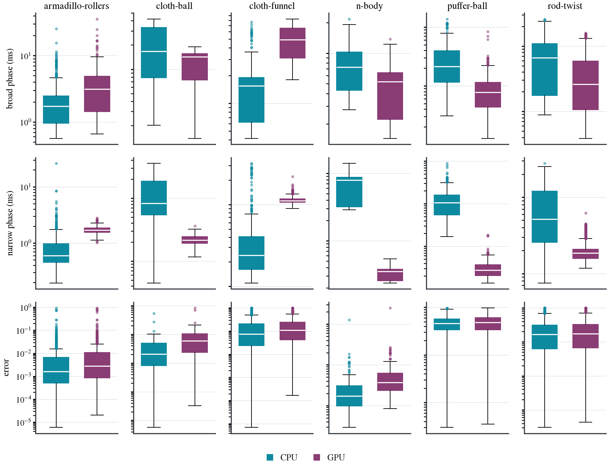
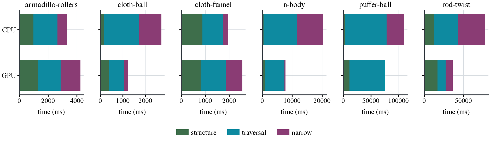
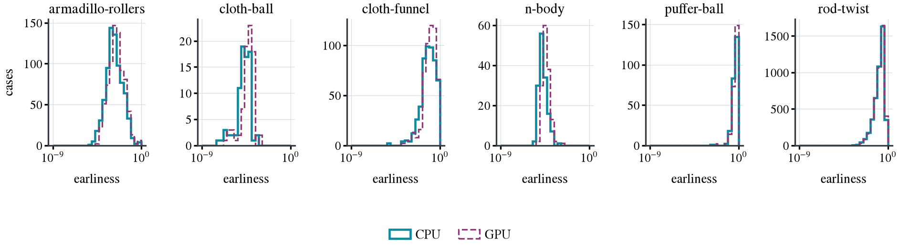

# Benchmarks — `Relaxed`

SCCD's `Relaxed` mode on the same six scenes, the same node and the same
committed data as [`BENCHMARKS.md`](BENCHMARKS.md), which evaluates `Tight`.

The two are reported separately because they answer different questions.
`Tight` reproduces TightInclusion's answer exactly and is what the headline
evaluation measures. `Relaxed` accepts a box sooner, buying speed on some scenes
with a looser time of impact on all of them. Averaging them would describe
neither.

Regenerate with:

```sh
python3 -m report benchmark/results/sweep-gh200-bp.csv /tmp/report \
        benchmark/results/oracle-gh200-all.csv \
        --modes=relaxed,device-relaxed --label="relaxed:CPU,device-relaxed:GPU" \
        --figure-prefix=relaxed- --embed=docs/BENCHMARKS_RELAXED.md --check
```

## 1. What it trades

Against `Tight`, on the same cases:

| | |
|---|---|
| median earliness | **17× looser** (6.4e-05 against 3.7e-06) |
| narrow phase, CPU | 1.4× faster on armadillo-rollers, cloth-funnel and rod-twist; **2× slower** on cloth-ball, n-body and puffer-ball |
| narrow phase, GPU | 1.0× to 1.8× faster, never slower |
| conservativeness | identical — zero missed, zero late |

The accuracy cost is unconditional; the speed gain is not. On the host `Relaxed`
loses on half the scenes, because accepting a box sooner also hands the next
query a looser bound, so it prunes less. On the device it wins or ties
everywhere, and by the widest margin on rod-twist.

**It is exactly as conservative.** The invariant does not depend on how tight
the acceptance test is: accepting reports the box's `t` lower bound, which is at
or before any root inside it, so a looser test reports earlier and never later.

## 2. Conservativeness

<!-- sccd:begin gate -->

| scene             | phase | mode | queries checked | missed | late |
|-------------------|-------|------|----------------:|-------:|-----:|
| armadillo-rollers | EE    | GPU  |          98,757 |      0 |    0 |
| armadillo-rollers | EE    | CPU  |          98,757 |      0 |    0 |
| armadillo-rollers | VF    | GPU  |          32,102 |      0 |    0 |
| armadillo-rollers | VF    | CPU  |          32,102 |      0 |    0 |
| cloth-ball        | EE    | GPU  |         557,667 |      0 |    0 |
| cloth-ball        | EE    | CPU  |         557,667 |      0 |    0 |
| cloth-ball        | VF    | GPU  |         107,252 |      0 |    0 |
| cloth-ball        | VF    | CPU  |         107,252 |      0 |    0 |
| cloth-funnel      | EE    | GPU  |           6,249 |      0 |    0 |
| cloth-funnel      | EE    | CPU  |           6,249 |      0 |    0 |
| cloth-funnel      | VF    | GPU  |             524 |      0 |    0 |
| cloth-funnel      | VF    | CPU  |             524 |      0 |    0 |
| n-body            | EE    | GPU  |       2,399,741 |      0 |    0 |
| n-body            | EE    | CPU  |       2,399,741 |      0 |    0 |
| n-body            | VF    | GPU  |         547,870 |      0 |    0 |
| n-body            | VF    | CPU  |         547,870 |      0 |    0 |
| puffer-ball       | EE    | GPU  |       1,187,257 |      0 |    0 |
| puffer-ball       | EE    | CPU  |       1,187,257 |      0 |    0 |
| puffer-ball       | VF    | GPU  |         299,533 |      0 |    0 |
| puffer-ball       | VF    | CPU  |         299,533 |      0 |    0 |
| rod-twist         | EE    | GPU  |         245,025 |      0 |    0 |
| rod-twist         | EE    | CPU  |         245,025 |      0 |    0 |
| rod-twist         | VF    | GPU  |          40,406 |      0 |    0 |
| rod-twist         | VF    | CPU  |          40,406 |      0 |    0 |

TightInclusion is excluded from this table: it is the reference the queries were selected against, not a subject of it.

Source: `benchmark/results/oracle-gh200-all.csv`

<!-- sccd:end gate -->

<!-- sccd:begin conservativeness -->

| scene             | mode |   queries | toi compared | late | false pos. | false neg. |
|-------------------|------|----------:|-------------:|-----:|-----------:|-----------:|
| armadillo-rollers | GPU  |   131,441 |      130,859 |    0 |        322 |          0 |
| armadillo-rollers | CPU  |   131,441 |      130,859 |    0 |        232 |          0 |
| cloth-ball        | GPU  |   664,940 |      664,919 |    0 |          2 |          0 |
| cloth-ball        | CPU  |   664,940 |      664,919 |    0 |          2 |          0 |
| cloth-funnel      | GPU  |     7,552 |        6,773 |    0 |        742 |          0 |
| cloth-funnel      | CPU  |     7,552 |        6,773 |    0 |        687 |          0 |
| n-body            | GPU  | 2,947,719 |    2,947,611 |    0 |         28 |          0 |
| n-body            | CPU  | 2,947,719 |    2,947,611 |    0 |          9 |          0 |
| puffer-ball       | GPU  | 1,514,172 |    1,486,790 |    0 |     27,380 |          0 |
| puffer-ball       | CPU  | 1,514,172 |    1,486,790 |    0 |     27,380 |          0 |
| rod-twist         | GPU  |   549,208 |      285,431 |    0 |    244,973 |          0 |
| rod-twist         | CPU  |   549,208 |      285,431 |    0 |    228,608 |          0 |

Measured against the exact roots shipped with the dataset, not against TightInclusion: TightInclusion's own answer is itself a lower bound on the truth, so comparing against it over-reports lateness.

Source: `benchmark/results/sweep-gh200-bp.csv`

<!-- sccd:end conservativeness -->

False positives are where the looseness shows: `Relaxed` reports more of them
than `Tight` on every scene, by roughly two orders of magnitude on rod-twist.
They cost work, never safety.

The mesh path is checked against the curated query geometry as a tripwire on the
inputs:

<!-- sccd:begin mesh-check -->

The mesh path agrees with the curated query geometry on every case.

<!-- sccd:end mesh-check -->

## 3. Accuracy

<!-- sccd:begin earliness-ref -->

| scene             | phase | mode           | median earliness | worst case |
|-------------------|-------|----------------|-----------------:|-----------:|
| armadillo-rollers | EE    | CPU            |         3.47e-05 |   7.37e-01 |
| armadillo-rollers | EE    | GPU            |         7.59e-05 |   7.37e-01 |
| armadillo-rollers | EE    | TightInclusion |         3.11e-06 |   1.60e-02 |
| armadillo-rollers | VF    | CPU            |         6.44e-05 |   9.41e-01 |
| armadillo-rollers | VF    | GPU            |         1.05e-04 |   9.41e-01 |
| armadillo-rollers | VF    | TightInclusion |         3.74e-06 |   9.39e-03 |
| cloth-ball        | EE    | CPU            |         3.13e-07 |   5.40e-04 |
| cloth-ball        | EE    | GPU            |         1.13e-06 |   9.01e-04 |
| cloth-ball        | EE    | TightInclusion |         1.05e-07 |   1.04e-04 |
| cloth-ball        | VF    | CPU            |         2.96e-07 |   7.86e-05 |
| cloth-ball        | VF    | GPU            |         1.09e-06 |   2.18e-04 |
| cloth-ball        | VF    | TightInclusion |         9.76e-08 |   2.88e-05 |
| cloth-funnel      | EE    | CPU            |                0 |   1.00e+00 |
| cloth-funnel      | EE    | GPU            |                0 |   1.00e+00 |
| cloth-funnel      | EE    | TightInclusion |                0 |   1.00e+00 |
| cloth-funnel      | VF    | CPU            |         1.56e-02 |   9.97e-01 |
| cloth-funnel      | VF    | GPU            |         2.76e-02 |   9.97e-01 |
| cloth-funnel      | VF    | TightInclusion |         3.33e-04 |   2.67e-02 |
| n-body            | EE    | CPU            |         1.79e-08 |   1.27e-03 |
| n-body            | EE    | GPU            |         1.10e-07 |   2.56e-03 |
| n-body            | EE    | TightInclusion |         1.14e-08 |   1.89e-04 |
| n-body            | VF    | CPU            |         1.84e-08 |   1.53e-04 |
| n-body            | VF    | GPU            |         1.03e-07 |   2.60e-04 |
| n-body            | VF    | TightInclusion |         1.17e-08 |   1.87e-05 |
| puffer-ball       | EE    | CPU            |         3.57e-02 |   9.61e-01 |
| puffer-ball       | EE    | GPU            |         3.64e-02 |   9.62e-01 |
| puffer-ball       | EE    | TightInclusion |         3.54e-05 |   2.61e-01 |
| puffer-ball       | VF    | CPU            |         4.68e-02 |   9.75e-01 |
| puffer-ball       | VF    | GPU            |         4.62e-02 |   9.75e-01 |
| puffer-ball       | VF    | TightInclusion |         4.58e-05 |   5.04e-02 |
| rod-twist         | EE    | CPU            |         3.23e-02 |   9.93e-01 |
| rod-twist         | EE    | GPU            |         3.53e-02 |   9.93e-01 |
| rod-twist         | EE    | TightInclusion |         3.69e-04 |   9.85e-01 |
| rod-twist         | VF    | CPU            |         1.71e-02 |   9.96e-01 |
| rod-twist         | VF    | GPU            |         1.90e-02 |   9.96e-01 |
| rod-twist         | VF    | TightInclusion |         1.54e-04 |   9.93e-01 |

Source: `benchmark/results/oracle-gh200-all.csv`

<!-- sccd:end earliness-ref -->

The worst case reaches 1.0 on cloth-funnel, puffer-ball and rod-twist — a step
reported at its start when the true contact is at its end. TightInclusion's
worst case is the same on those scenes, so the ceiling belongs to the geometry;
what `Relaxed` gives up is the **median**, and it gives up about 17× of it.

## 4. Against TightInclusion

<!-- sccd:begin reference -->

| scene             | phase | mode           |   queries |      hits |         time ms |     vs. TI |
|-------------------|-------|----------------|----------:|----------:|----------------:|-----------:|
| armadillo-rollers | EE    | GPU            |    99,104 |    98,933 |     1876 / 1883 |       5.4× |
| armadillo-rollers | EE    | CPU            |    99,104 |    98,895 |     2906 / 2909 |       3.5× |
| armadillo-rollers | EE    | TightInclusion |    99,104 |    98,761 |   10113 / 10133 | 1.0× (ref) |
| armadillo-rollers | VF    | GPU            |    32,337 |    32,248 |     1431 / 1440 |       5.1× |
| armadillo-rollers | VF    | CPU            |    32,337 |    32,196 |     1794 / 1804 |       4.0× |
| armadillo-rollers | VF    | TightInclusion |    32,337 |    32,122 |     7231 / 7231 | 1.0× (ref) |
| cloth-ball        | EE    | GPU            |   557,683 |   557,669 |       517 / 522 |       5.1× |
| cloth-ball        | EE    | CPU            |   557,683 |   557,669 |       648 / 650 |       4.1× |
| cloth-ball        | EE    | TightInclusion |   557,683 |   557,668 |     2655 / 2655 | 1.0× (ref) |
| cloth-ball        | VF    | GPU            |   107,257 |   107,252 |       372 / 377 |       3.4× |
| cloth-ball        | VF    | CPU            |   107,257 |   107,252 |       282 / 282 |       4.5× |
| cloth-ball        | VF    | TightInclusion |   107,257 |   107,252 |     1280 / 1281 | 1.0× (ref) |
| cloth-funnel      | EE    | GPU            |     6,751 |     6,734 |       670 / 690 |       4.3× |
| cloth-funnel      | EE    | CPU            |     6,751 |     6,700 |       668 / 678 |       4.3× |
| cloth-funnel      | EE    | TightInclusion |     6,751 |     6,259 |     2874 / 2935 | 1.0× (ref) |
| cloth-funnel      | VF    | GPU            |       801 |       781 |       323 / 330 |       3.7× |
| cloth-funnel      | VF    | CPU            |       801 |       760 |         79 / 81 |      15.1× |
| cloth-funnel      | VF    | TightInclusion |       801 |       529 |     1197 / 1199 | 1.0× (ref) |
| n-body            | EE    | GPU            | 2,399,812 | 2,399,762 |     1087 / 1091 |       4.7× |
| n-body            | EE    | CPU            | 2,399,812 | 2,399,747 |     6603 / 6612 |       0.8× |
| n-body            | EE    | TightInclusion | 2,399,812 | 2,399,746 |     5094 / 5111 | 1.0× (ref) |
| n-body            | VF    | GPU            |   547,907 |   547,877 |       650 / 653 |       2.9× |
| n-body            | VF    | CPU            |   547,907 |   547,873 |       437 / 438 |       4.4× |
| n-body            | VF    | TightInclusion |   547,907 |   547,873 |     1911 / 1914 | 1.0× (ref) |
| puffer-ball       | EE    | GPU            | 1,206,952 | 1,206,951 |       323 / 325 |      12.2× |
| puffer-ball       | EE    | CPU            | 1,206,952 | 1,206,951 |       213 / 215 |      18.5× |
| puffer-ball       | EE    | TightInclusion | 1,206,952 | 1,187,650 |     3958 / 3998 | 1.0× (ref) |
| puffer-ball       | VF    | GPU            |   307,220 |   307,219 |       248 / 253 |       7.0× |
| puffer-ball       | VF    | CPU            |   307,220 |   307,219 |         75 / 76 |      23.0× |
| puffer-ball       | VF    | TightInclusion |   307,220 |   299,676 |     1733 / 1747 | 1.0× (ref) |
| rod-twist         | EE    | GPU            |   492,120 |   474,114 |     9269 / 9387 |      46.6× |
| rod-twist         | EE    | CPU            |   492,120 |   458,641 |   38006 / 38053 |      11.4× |
| rod-twist         | EE    | TightInclusion |   492,120 |   246,132 | 432019 / 432263 | 1.0× (ref) |
| rod-twist         | VF    | GPU            |    57,088 |    56,290 |     4801 / 4805 |      15.8× |
| rod-twist         | VF    | CPU            |    57,088 |    55,398 |     5024 / 5074 |      15.1× |
| rod-twist         | VF    | TightInclusion |    57,088 |    40,542 |   75762 / 75815 | 1.0× (ref) |

Source: `benchmark/results/oracle-gh200-all.csv`

<!-- sccd:end reference -->

## 5. CPU against GPU

<!-- sccd:begin processor -->

| scene             |  CPU ms | GPU ms | total | broad | narrow |
|-------------------|--------:|-------:|------:|------:|-------:|
| armadillo-rollers |   3,315 |  4,252 | 0.78x | 0.93x |  0.48x |
| cloth-ball        |   2,715 |  1,245 | 2.18x | 1.62x |  5.58x |
| cloth-funnel      |   1,957 |  2,552 | 0.77x | 0.93x |  0.32x |
| n-body            |  20,484 |  7,844 | 2.61x | 1.56x | 21.33x |
| puffer-ball       | 110,719 | 76,153 | 1.45x | 1.04x | 37.01x |
| rod-twist         |  78,021 | 36,350 | 2.15x | 1.57x |  3.90x |

A ratio is the host median over the device median, so 2.0 means the device takes half the time. Ratios below 1.0 are the cases where the host wins and are the ones worth reading.

Source: `benchmark/results/sweep-gh200-bp.csv`

<!-- sccd:end processor -->

## 6. Timing

Phases are as defined in [`BENCHMARKS.md`](BENCHMARKS.md#2-what-each-phase-measures):
*prep* builds the swept boxes and the acceleration structure, *broad* runs the
overlap query, *narrow* finds the time of impact. Per simulation step, which
runs both query types:

<!-- sccd:begin per-frame -->

| scene             | frames | mode | broad ms | narrow ms | total ms |
|-------------------|-------:|------|---------:|----------:|---------:|
| armadillo-rollers |    396 | GPU  |     7.24 |      3.49 |    10.74 |
| armadillo-rollers |    396 | CPU  |     6.70 |      1.67 |     8.37 |
| cloth-ball        |     43 | GPU  |    24.86 |      4.09 |    28.95 |
| cloth-ball        |     43 | CPU  |    40.30 |     22.84 |    63.14 |
| cloth-funnel      |    372 | GPU  |     5.00 |      1.86 |     6.86 |
| cloth-funnel      |    372 | CPU  |     4.67 |      0.60 |     5.26 |
| n-body            |     74 | GPU  |   100.38 |      5.62 |   106.00 |
| n-body            |     74 | CPU  |   156.92 |    119.89 |   276.80 |
| puffer-ball       |    120 | GPU  |   627.37 |      7.23 |   634.60 |
| puffer-ball       |    120 | CPU  |   655.03 |    267.64 |   922.66 |
| rod-twist         |  2,556 | GPU  |    10.71 |      3.51 |    14.22 |
| rod-twist         |  2,556 | CPU  |    16.83 |     13.69 |    30.52 |

A mean rather than a median over steps: the scene total is what a run costs, and the mean is the only average that divides back into it.

Source: `benchmark/results/sweep-gh200-bp.csv`

<!-- sccd:end per-frame -->


<!-- sccd:begin timing -->

| scene             | mode | cases |         pairs | rep |          broad ms |       earliest ms |       per-pair ms |            total ms |
|-------------------|------|------:|--------------:|----:|------------------:|------------------:|------------------:|--------------------:|
| armadillo-rollers | GPU  |   781 |    85,296,282 |   3 |   2868.1 / 2910.5 |   1384.0 / 1418.0 |   2370.0 / 2385.8 |     4286.1 / 4294.5 |
| armadillo-rollers | CPU  |   781 |    85,296,282 |   3 |   2653.9 / 2830.6 |     661.3 / 675.7 |   2125.2 / 2182.5 |     3315.2 / 3506.3 |
| cloth-ball        | GPU  |    79 |   175,150,856 |   3 |   1069.0 / 1076.7 |     175.9 / 177.9 |     926.4 / 933.7 |     1244.9 / 1254.6 |
| cloth-ball        | CPU  |    79 |   175,150,856 |   3 |   1736.5 / 1738.1 |     981.9 / 984.6 |   1766.7 / 1770.2 |     2716.9 / 2720.0 |
| cloth-funnel      | GPU  |   577 |    25,192,698 |   3 |   1858.9 / 1874.3 |     692.7 / 696.3 |     734.3 / 749.4 |     2531.5 / 2570.6 |
| cloth-funnel      | CPU  |   577 |    25,192,698 |   3 |   1740.1 / 1776.3 |     221.4 / 233.2 |     357.0 / 374.9 |     1954.2 / 2009.5 |
| n-body            | GPU  |   146 | 2,253,766,609 |   3 |   7420.8 / 7439.8 |     416.0 / 416.4 |   4500.9 / 4537.3 |     7836.8 / 7850.8 |
| n-body            | CPU  |   146 | 2,253,766,609 |   3 | 11612.0 / 11616.5 |   8871.6 / 8889.1 | 16546.3 / 16562.8 |   20478.5 / 20483.6 |
| puffer-ball       | GPU  |   240 | 7,327,014,600 |   3 | 75325.5 / 75381.8 |     867.7 / 897.7 | 10762.8 / 11312.7 |   76223.2 / 76249.5 |
| puffer-ball       | CPU  |   240 | 7,327,014,600 |   3 | 78662.7 / 78979.6 | 32116.3 / 32125.6 | 34884.3 / 35236.7 | 110788.3 / 110910.7 |
| rod-twist         | GPU  |  4571 | 3,872,779,843 |   3 | 27376.2 / 28768.3 |   8974.2 / 9073.6 | 19787.8 / 19928.4 |   36449.8 / 37742.5 |
| rod-twist         | CPU  |  4571 | 3,872,779,843 |   3 | 43159.9 / 43660.7 | 34994.6 / 35202.6 | 62239.9 / 62497.5 |   78362.6 / 78655.2 |

Each cell is the median over repeats and the slowest of them. A difference smaller than the gap between the two does not separate two modes and is not reported as a ratio anywhere in this document. Which mode is faster depends on the output mode as well as the scene, so the two are given side by side rather than one standing for the other.

Source: `benchmark/results/sweep-gh200-bp.csv`

<!-- sccd:end timing -->

<!-- sccd:begin throughput -->

| scene             | mode | broad Mpair/s | narrow Mpair/s |
|-------------------|------|--------------:|---------------:|
| armadillo-rollers | GPU  |          29.7 |           61.6 |
| armadillo-rollers | CPU  |          32.1 |          129.0 |
| cloth-ball        | GPU  |         163.8 |          995.9 |
| cloth-ball        | CPU  |         100.9 |          178.4 |
| cloth-funnel      | GPU  |          13.6 |           36.4 |
| cloth-funnel      | CPU  |          14.5 |          113.8 |
| n-body            | GPU  |         303.7 |         5418.1 |
| n-body            | CPU  |         194.1 |          254.0 |
| puffer-ball       | GPU  |          97.3 |         8444.2 |
| puffer-ball       | CPU  |          93.1 |          228.1 |
| rod-twist         | GPU  |         141.5 |          431.5 |
| rod-twist         | CPU  |          89.7 |          110.7 |

Source: `benchmark/results/sweep-gh200-bp.csv`

<!-- sccd:end throughput -->

## 7. Figures

Scenes across the columns, one quantity per row, distributions over cases as box
plots on logarithmic axes.



**Figure 1.** Per-case distributions over the six scenes: broad-phase time,
narrow-phase time, and error against the exact root.



**Figure 2.** Runtime split into *prep*, *broad* and *narrow*.



**Figure 3.** Error against the exact symbolic roots, log axis. One-sided by
construction: every value is on the safe side. The device curve is dashed where the two
coincide.

## 8. Provenance

<!-- sccd:begin provenance -->

- Timings: `benchmark/results/sweep-gh200-bp.csv`, 6394 cases over 6 scenes, 3 independent repeats.
- Accuracy: `benchmark/results/oracle-gh200-all.csv`, every query of every scene checked against the dataset's exact roots.
- Regenerate with `python3 -m report <bench.csv> <out> <oracle.csv> --embed=docs/BENCHMARKS.md`; add `--check` to assert the document still matches the data.

<!-- sccd:end provenance -->
